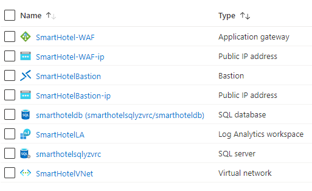

Line-of-business application migration

Before the hands-on lab setup guide

February 2022

Information in this document, including URL and other Internet Web site references, is subject to change without notice. Unless otherwise noted, the example companies, organizations, products, domain names, e-mail addresses, logos, people, places, and events depicted herein are fictitious, and no association with any real company, organization, product, domain name, e-mail address, logo, person, place or event is intended or should be inferred. Complying with all applicable copyright laws is the responsibility of the user. Without limiting the rights under copyright, no part of this document may be reproduced, stored in or introduced into a retrieval system, or transmitted in any form or by any means (electronic, mechanical, photocopying, recording, or otherwise), or for any purpose, without the express written permission of Microsoft Corporation.

Microsoft may have patents, patent applications, trademarks, copyrights, or other intellectual property rights covering subject matter in this document. Except as expressly provided in any written license agreement from Microsoft, the furnishing of this document does not give you any license to these patents, trademarks, copyrights, or other intellectual property.

The names of manufacturers, products, or URLs are provided for informational purposes only and Microsoft makes no representations and warranties, either expressed, implied, or statutory, regarding these manufacturers or the use of the products with any Microsoft technologies. The inclusion of a manufacturer or product does not imply endorsement of Microsoft of the manufacturer or product. Links may be provided to third party sites. Such sites are not under the control of Microsoft and Microsoft is not responsible for the contents of any linked site or any link contained in a linked site, or any changes or updates to such sites. Microsoft is not responsible for webcasting or any other form of transmission received from any linked site. Microsoft is providing these links to you only as a convenience, and the inclusion of any link does not imply endorsement of Microsoft of the site or the products contained therein.

© 2022 Microsoft Corporation. All rights reserved.

Microsoft and the trademarks listed at <https://www.microsoft.com/en-us/legal/intellectualproperty/Trademarks/Usage/General.aspx> are trademarks of the Microsoft group of companies. All other trademarks are property of their respective owners.

**Contents**

<!-- TOC -->

- [Line-of-business application migration before the hands-on lab setup guide](#line-of-business-application-migration-before-the-hands-on-lab-setup-guide)
  - [Requirements](#requirements)
  - [Before the hands-on lab](#before-the-hands-on-lab)
    - [Task 1: Deploy the on-premises environment and landing zone](#task-1-deploy-the-on-premises-environment-and-landing-zone)
    - [Task 2: Verify the on-premises environment](#task-2-verify-the-on-premises-environment)
    - [Task 3: Verify the landing zone environment](#task-3-verify-the-landing-zone-environment)

<!-- /TOC -->

# Line-of-business application migration before the hands-on lab setup guide 

## Requirements

1. You will need Owner or Contributor permissions for an Azure subscription to use in the lab.

2. Your subscription must have sufficient unused quota to deploy the VMs used in this lab. To check your quota:

    - Log in to the Azure portal, select **All services** then **Subscriptions**. Select your subscription, then choose **Usage + quotas**.
  
    - From the **Select a provider** drop-down, select **Microsoft.Compute**.
  
    - From the **All service quotas** drop down, select **Standard DSv3 Family vCPUs**, **Standard FSv2 Family vCPUs** and **Total Regional vCPUs**.
  
    - From the **All locations** drop down, select the location where you will deploy the lab.
  
    - From the last drop-down, select **Show all**.
  
    - Check that the selected quotas have sufficient unused capacity:
  
        - Standard DSv3 Family vCPUs: **at least 8 vCPUs**.
  
        - Standard FSv2 Family vCPUs: **at least 6 vCPUs**.

        - Total Regional vCPUs: **at least 14 vCPUs**.

    > **Note:** If you are using an Azure Pass subscription, you may not meet the vCPU quotas above. In this case, you can still complete the lab, by taking the following steps:

     >- Deploy the 'on-premises' environment (see below) in a different Azure region to the Azure VMs created during migration. With this change you will only need 8 Total Regional vCPUs. Migration will take a little longer since data must be transferred between regions.
        
     >- Use a different VM tier instead of FSv2 for the migrated VMs (for example, DSv2 or DSv3). However, you cannot change the tier of the DSv3 VM, since this tier is required for the nested virtualization support used to implement the 'on-premises' environment.

## Before the hands-on lab

Duration: 60 minutes

### Task 1: Deploy the on-premises environment and landing zone

1. Deploy the template **SmartHotelHost.json** to a new resource group. This template deploys a virtual machine running nested Hyper-V, with 4 nested VMs. This comprises the 'on-premises' environment which you will assess and migrate during this lab.

    You can deploy the template by selecting the 'Deploy to Azure' button below. You will need to create a new resource group. The suggested resource group base name (prefix) to use is **SmartHotel**. You will also need to select a location close to you to deploy the template to. Then choose **Review + create** followed by **Create**. 

    

    > **Note:** The template will take around 6-7 minutes to deploy. Once template deployment is complete, several additional scripts are executed to bootstrap the lab environment. **Allow at least 1 hour from the start of template deployment for the scripts to run.**

### Task 2: Verify the on-premises environment

1. Navigate to the **SmartHotelHost** VM that was deployed by the template in the previous step.

2. Make a note of the public IP address.

3. Open a browser tab and navigate to **http://\<SmartHotelHostIP-Address\>**. You should see the SmartHotel application, which is running on nested VMs within Hyper-V on the SmartHotelHost. (The application doesn't do much: you can refresh the page to see the list of guests or select 'CheckIn' or 'CheckOut' to toggle their status.)

    

    > **Note:** If the SmartHotel application is not shown, wait 10 minutes and try again. It takes **at least 1 hour** from the start of template deployment. You can also check the CPU, network and disk activity levels for the SmartHotelHost VM in the Azure portal, to see if the provisioning is still active.

### Task 3: Verify the landing zone environment

1. Navigate to the **SmartHotelRG** resource group.
 
2. Note the Virtual Network, Bastion resource, Application Gateway, and SQL Server are available.

     

You should follow all steps provided *before* performing the Hands-on lab.
