**Contents** 

<!-- TOC -->

- [Line-of-business application migration hands-on lab step-by-step](#line-of-business-application-migration-hands-on-lab-step-by-step)
  - [Abstract and learning objectives](#abstract-and-learning-objectives)
  - [Overview](#overview)
  - [Solution architecture](#solution-architecture)
  - [Requirements](#requirements)
  - [Before the hands-on lab](#before-the-hands-on-lab)
  - [Exercise 1: Discover and assess the on-premises environment](#exercise-1-discover-and-assess-the-on-premises-environment)
    - [Task 1: Create the Azure Migrate project and add assessment and migration tools](#task-1-create-the-azure-migrate-project-and-add-assessment-and-migration-tools)
    - [Task 2: Deploy the Azure Migrate appliance](#task-2-deploy-the-azure-migrate-appliance)
    - [Task 3: Configure the Azure Migrate appliance](#task-3-configure-the-azure-migrate-appliance)
    - [Task 4: Create a migration assessment](#task-4-create-a-migration-assessment)
    - [Task 5: Configure dependency visualization](#task-5-configure-dependency-visualization)
    - [Task 6: Explore dependency visualization](#task-6-explore-dependency-visualization)
  - [Exercise 2: Migrate the Application Database](#exercise-2-migrate-the-application-database)
    - [Task 1: Register the Microsoft.DataMigration resource provider](#task-1-register-the-microsoftdatamigration-resource-provider)
    - [Task 2: Create the Database Migration Service](#task-2-create-the-database-migration-service)
    - [Task 3: Assess the on-premises database using Data Migration Assistant](#task-3-assess-the-on-premises-database-using-data-migration-assistant)
    - [Task 4: Create a DMS migration project](#task-4-create-a-dms-migration-project)
    - [Task 5: Migrate the database schema](#task-5-migrate-the-database-schema)
    - [Task 6: Migrate the on-premises data](#task-6-migrate-the-on-premises-data)
  - [Exercise 3: Migrate the application and web tiers using Azure Migrate: Server Migration](#exercise-3-migrate-the-application-and-web-tiers-using-azure-migrate-server-migration)
    - [Task 1: Create a Storage Account](#task-1-create-a-storage-account)
    - [Task 2: Create a Private Endpoint](#task-2-create-a-private-endpoint)
    - [Task 3: Register the Hyper-V Host with Azure Migrate: Server Migration](#task-3-register-the-hyper-v-host-with-azure-migrate-server-migration)
    - [Task 4: Enable Replication from Hyper-V to Azure Migrate](#task-4-enable-replication-from-hyper-v-to-azure-migrate)
    - [Task 5: Configure static internal IP addresses for each VM](#task-5-configure-static-internal-ip-addresses-for-each-vm)
    - [Task 6: Server migration](#task-6-server-migration)
    - [Task 7: Configure the database connection](#task-7-configure-the-database-connection)
    - [Task 8: Configure the public IP address and test the SmartHotel application](#task-8-configure-the-public-ip-address-and-test-the-smarthotel-application)
    - [Task 9: Post-migration steps](#task-9-post-migration-steps)
  - [After the hands-on lab](#after-the-hands-on-lab)
    - [Task 1: Clean up resources](#task-1-clean-up-resources)

<!-- /TOC -->

# Line-of-business application migration hands-on lab step-by-step

## Abstract and learning objectives

In this hands-on lab, you will learn how to assess and migrate a multi-tier application from Hyper-V to Azure. You will learn how to use Azure Migrate as the hub for executing a migration, together with accompanying tools.

After this hands-on lab, you will know the role of Azure Migrate and related migration tools and how to use them to successfully migrate an on-premises multi-tier application to Azure.

## Overview

Before the lab, you will have pre-deployed an on-premises infrastructure hosted in Hyper-V.  This infrastructure is hosting a multi-tier application called 'SmartHotel', using Hyper-V VMs for each of the application tiers.

During the lab, you will migrate this entire application stack to Azure. This will include assessing the on-premises application using Azure Migrate; assessing the database migration using Microsoft Data Migration Assistant (DMA); migrating the database using the Azure Database Migration Service (DMS); and migrating the web and application tiers using Azure Migrate: Server Migration. This last step includes migration of both Windows and Linux VMs.

## Solution architecture

The SmartHotel application comprises 4 VMs hosted in Hyper-V:

- **Database tier** Hosted on the smarthotelSQL1 VM, which is running Windows Server 2016 and SQL Server 2017.

- **Application tier** Hosted on the smarthotelweb2 VM, which is running Windows Server 2012R2.

- **Web tier** Hosted on the smarthotelweb1 VM, which is running Windows Server 2012R2.

- **Web proxy** Hosted on the  UbuntuWAF VM, which is running Nginx on Ubuntu 18.04 LTS.

For simplicity, there is no redundancy in any of the tiers.

>**Note:** For convenience, the Hyper-V host itself is deployed as an Azure VM. For the purposes of the lab, you should think of it as an on-premises machine.

![A slide shows the on-premises SmartHotel application architecture. This comprises a SmartHotelHost server running Microsoft Hyper-V. This server hosts 4 VMs: UbuntuWAF, SmartHotelWeb1, SmartHotelWeb2, and SmartHotelSQL1. A series of arrows show how these VMs will be migrated to Azure. The first 3 VMs have an arrow labeled 'Azure Migrate: Server Migration' pointing to 3 similarly-labeled VMs in Azure. The last VM, SmartHotelSQL1, has an arrow labeled 'Azure Database Migration Service' pointing to an Azure SQL Database. A third arrow labeled 'Azure Migrate: Server Assessment' and 'Data Migration Assistant (DMA)' points from all 4 on-premises VMs to an Azure Migrate dashboard showing migration readiness.](images/overview.png "SmartHotel Migration Overview")

Throughout this lab, you will use Azure Migrate as your primary tool for assessment and migration. In conjunction with Azure Migrate, you will also use a range of other tools, as detailed below.

To assess the Hyper-V environment, you will use Azure Migrate: Server Assessment. This includes deploying the Azure Migrate appliance on the Hyper-V host to gather information about the environment. For deeper analysis, the Microsoft Monitoring Agent and Dependency Agent will be installed on the VMs, enabling the Azure Migrate dependency visualization.

The SQL Server database will be assessed by installing the Microsoft Data Migration Assistant (DMA) on the Hyper-V host, and using it to gather information about the database. Schema migration and data migration will then be completed using the Azure Database Migration Service (DMS).

The application, web, and web proxy tiers will be migrated to Azure VMs using Azure Migrate: Server Migration. You will walk through the steps of building the Azure environment, replicating data to Azure, customizing VM settings, and performing a failover to migrate the application to Azure.

> **Note**: After migration, the application could be modernized to use Azure Application Gateway instead of the Ubuntu Nginx VM, and to use Azure App Service to host both the web tier and application tiers. These optimizations are out of scope of this lab, which is focused only on a 'lift and shift' migration to Azure VMs.

## Requirements

1. You will need Owner or Contributor permissions for an Azure subscription to use in the lab.

2. Your subscription must have sufficient unused quota to deploy the VMs used in this lab.

## Before the hands-on lab

Refer to the [Before the HOL - Line-of-business application migration](./Before%20the%20HOL%20-%20Line-of-business%20application%20migration.md) setup guide manual before continuing to the lab exercises.

**Important**: Allow at least 60 minutes to deploy the on-premises environment before you start the lab.

## Exercise 1: Discover and assess the on-premises environment

Duration: 60 minutes

In this exercise, you will use Azure Migrate: Server Assessment to assess the on-premises environment. This will include selecting Azure Migrate tools, deploying the Azure Migrate appliance into the on-premises environment, creating a migration assessment, and using the Azure Migrate dependency visualization.

### Task 1: Create the Azure Migrate project and add assessment and migration tools

In this task, you will create the Azure Migrate project and select the assessment and migration tools.

> **Note**: In this lab, you will use the Microsoft-provided assessment and migration tools within Azure Migrate. A number of third-party tools are also integrated with Azure Migrate for both assessment and migration. You may wish to spend some time exploring these third-party options outside of this lab.

1. Open your browser, navigate to **<https://portal.azure.com>**, and log in with your Azure subscription credentials.

2. Expand the left navigation, and select **All services**. Search for and select **Azure Migrate** to open the Azure Migrate Overview blade, shown below.

    

3. From the **Get started** tab, select the **Discover, assess and migrate** button located beneath the **Servers, databases and web apps** heading.

      

4. On the **Servers, databases and web apps** screen, select **Create project**.

    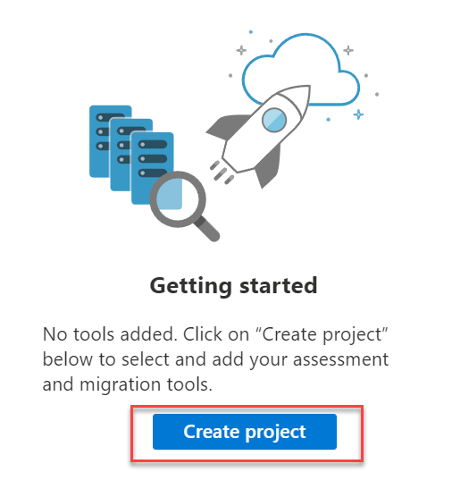

5. On the **Create project** screen, select your subscription and create a new resource group named **AzureMigrateRG**. Enter **SmartHotelMigration** as the Project name, and choose a Geography close to you to store the migration assessment data. Then select **Create**.

    >**Note**: If you are running this lab in a shared subscription you will need to use a migrate project name that is unique in the subscription. Append characters to the end of migrate project name to make your project name unique. For example: **SmartHotelMigration1234**.

    

6. The Azure Migrate project deployment will start. Once it has completed, you should see the **Azure Migrate: Discovery and assessment** and **Azure Migrate: Server Migration** panels for the current migration project, as shown below.

    

#### Task summary

In this task you created an Azure Migrate project, using the default built-in tools for server assessment and server migration.

### Task 2: Deploy the Azure Migrate appliance

In this task, you will deploy and configure the Azure Migrate appliance in the on-premises Hyper-V environment. This appliance communicates with the Hyper-V server to gather configuration and performance data about your on-premises VMs, and returns that data to your Azure Migrate project.

1. Within the **Azure Migrate: Discovery and assessment** panel, select the **Discover** toolbar item. **Discover machines** blade.

      

2. On the **Discover** form, for the **Are your machines virtualized?** field, select **Yes, with Hyper-V**. Once selected, a form will appear.

    

3. In **1: Generate Azure Migrate project key**, provide **SmartHotelAppl** as name for the Azure Migrate appliance that you will set up for discovery of Hyper-V VMs. Select **Generate key** to start the creation of the required Azure resources.

    

    >**Note**: If you are running this lab in a shared Azure Migrate project, you will need to provide an appliance name that is unique in the project. Append characters to the end of appliance name to make your appliance name unique. For example: **SmartHotelAppl123**.

4. **Wait** for the key to be generated, then copy the **Azure Migrate project key** to your clipboard.

    

5. Read the instructions on how to download, deploy and configure the Azure Migrate appliance. Close the 'Discover machines' blade (do **not** download the .VHD file or .ZIP file, the .VHD has already been downloaded for you).

6. In a separate browser tab, navigate to the Azure portal. In the global search box, enter **SmartHotelHost**, then select the **SmartHotelHost** virtual machine.

    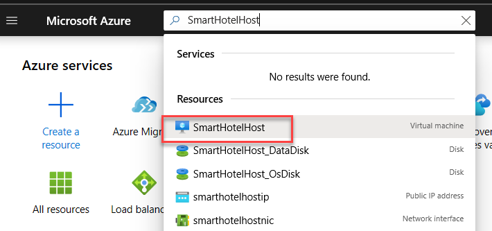

7. Select **Connect**, select **RDP**, then download the RDP file and connect to the virtual machine using username **demouser** and password **demo!pass123**.

8. In Server Manager, select **Tools**, then **Hyper-V Manager** (if Server Manager does not open automatically, open it by selecting **Start**, then **Server Manager**). In Hyper-V Manager, select **SMARTHOTELHOST**. You should now see a list of the four VMs that comprise the on-premises SmartHotel application.

    

    You will now deploy the Azure Migrate appliance virtual machine.  Normally, you would first need to download the .ZIP file containing the appliance to your Hyper-V host, and unzip it. To save time, these steps have been completed for you.

9. In Hyper-V Manager, under **Actions**, select **Import Virtual Machine...** to open the **Import Virtual Machine** wizard.

    

10. At the first step, **Before You Begin**, select **Next**.

11. At the **Locate Folder** step, select **Browse** and navigate to **F:\\VirtualMachines\\AzureMigrateAppliance** (the folder name may also include a version number), then choose **Select Folder**, then select **Next**.

    

12. At the **Select Virtual Machine** step, the **AzureMigrateAppliance** VM should already be selected. Select **Next**.

13. At the **Choose Import Type** step, keep the default setting **Register the virtual machine in-place**. Select **Next**.

14. At the **Connect Network** step, you will see an error that the virtual switch previously used by the Azure Migrate appliance could not be found. From the **Connection** drop down, select the **Azure Migrate Switch**, then select **Next**.

    

    > **Note**:  The Azure Migrate appliance needs access to the Internet to upload data to Azure. It also needs access to the Hyper-V host. However, it does not need direct access to the application VMs running on the Hyper-V host. To protect the application environment, the Azure Migrate Appliance should be deployed to a separate subnet within Hyper-V, rather than in the same subnet as your application. 
    >
    > The Hyper-V environment has a NAT network using the IP address space 192.168.0.0/16. The internal NAT switch used by the SmartHotel application uses the subnet 192.168.0.0/24, and each VM in the application has been assigned a static IP address from this subnet.
    >
    > The Azure Migrate Appliance will be connected to a separate subnet 192.168.1.0/24, which has been set up for you. Using the 'Azure Migrate Switch' connects the appliance to this subnet. The appliance is assigned an IP address from this subnet using a DHCP service running on the SmartHotelHost.

15. Review the summary page, then select **Finish** to create the Azure Migrate appliance VM.

16. In Hyper-V Manager, select the **AzureMigrateAppliance** VM, then select **Start** on the left.

   

#### Task summary

In this task you deployed the Azure Migrate appliance in the on-premises Hyper-V environment.

### Task 3: Configure the Azure Migrate appliance

In this task, you will configure the Azure Migrate appliance and use it to complete the discovery phase of the migration assessment.

1. In Hyper-V Manager, select the **AzureMigrateAppliance** VM, then select **Connect** on the left.

    

2. A new window will open showing the Azure Migrate appliance. Wait for the License terms screen to show, then select **Accept**.

    

3. On the **Customize settings** screen, set the Administrator password to **demo!pass123** (twice). Then select **Finish**.

    > **Note**: When entering the password, the VM uses a US keyboard mapping. If you are using a non-US keyboard, some characters may be entered incorrectly. Select the 'eyeball' icon in the second password entry box to check the password has been entered correctly.

    

4. At the **Connect to AzureMigrateAppliance** prompt, set the appliance screen size using the slider, then select **Connect**.

5. Log in with the Administrator password **demo!pass123** (the login screen may pick up your local keyboard mapping, use the 'eyeball' icon to check).

6. **Wait.** After a minute or two, the browser will open showing the Azure Migrate appliance configuration wizard (it can also be launched from the desktop shortcut).

    On opening of the appliance configuration wizard, a pop-up with the license terms will appear. Accept the terms by selecting **I agree**.

    

7. Under **Set up prerequisites**, the following two steps to verify Internet connectivity and time synchronization should pass automatically.

    

8. **Wait** while the wizard installs the latest Azure Migrate updates. If prompted for credentials, enter user name **Administrator** and password **demo!pass123**. Once the Azure Migrate updates are completed, you may see a pop-up if the management app restart is required, and if so, select **Refresh** to restart the app.  

    

    Once restarted, the 'Set up prerequisites' steps of the Azure Migrate wizard will re-run automatically. Once the prerequisites are completed, you can proceed to the next panel, **Verification of Azure Migrate project key**.

9. At the next phase of the wizard, **Verification of Azure Migrate project key**, paste the **Azure Migrate project key** copied from the Azure portal earlier. (If you do not have the key, go to **Server Assessment > Discover > Manage existing appliances**, select the appliance name you provided at the time of key generation and copy the corresponding key.). Select **Verify**.

    

10. Once verification completes select **Login** beneath the **Azure user login and appliance registration status** header.

    

11. The **Continue with Azure Login** dialog window displays, select the **Copy code &amp; login** button.

    

12. A new tab will open asking for a code. This code is already in the clipboard. Paste the code in the form.  You will then be asked for your Azure portal credentials to complete the login process.

    

13. **Wait** a few moments for the registration process to complete. A message will be displayed indicating the appliance is successfully registered.

    

    Once the registration has completed, you can proceed to the next panel, **2. Manage credentials and discovery sources**.

14. In **Step 1: Provide Hyper-V host credentials for discovery of Hyper-V VMs​**, select **Add credentials**.

    

15. Specify **hostlogin** as the friendly name for credentials, username **demouser**, and password **demo!pass123** for the Hyper-V host/cluster that the appliance will use to discover VMs. Select **Save**.

    

     > **Note**: The Azure Migrate appliance may not have picked up your local keyboard mapping. Select the 'eyeball' in the password box to check the password was entered correctly.

     > **Note:** Multiple credentials are supported for Hyper-V VMs discovery, via the 'Add more' button.

16. In **Step 2: Provide Hyper-V host/cluster details**, select **Add discovery source** to specify the Hyper-V host/cluster IP address/FQDN and the friendly name for credentials to connect to the host/cluster.

    

17. In the **Add discovery source** dialog, select **Add single item**, enter **SmartHotelHost** under 'IP Address / FQDN', and select **hostlogin** for **Map credentials**.

    

    > **Note:** You can either **Add single item** at a time or **Add multiple items** in one go. There is also an option to provide Hyper-V host/cluster details through **Import CSV**.

18. Select **Save**. The appliance will validate the connection to the Hyper-V hosts/clusters added and show the **Validation status** in the table against each host/cluster.

    

    > **Note:** When adding discovery sources:
    >
    > - For successfully validated hosts/clusters, you can view more details by selecting their IP address/FQDN.
    > - If validation fails for a host, review the error by selecting the Validation failed in the Status column of the table. Fix the issue and validate again.
    > - To remove hosts or clusters, select **Delete**.
    > - You can't remove a specific host from a cluster. You can only remove the entire cluster.
    > - You can add a cluster, even if there are issues with specific hosts in the cluster.

19. In **Step 3: Provide server credentials to perform software inventory and agentless dependency analysis.**, disable the slider to the off position.

    

20. Select **Start discovery** to kick off VM discovery from the successfully validated hosts/clusters.

    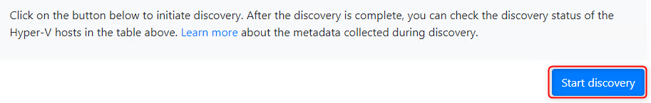

21. Wait for the Azure Migrate status to show **Discovery has been successfully initiated**. This will take several minutes. After the discovery has been successfully initiated, you can check the discovery status against each host/cluster in the table.

22. Return to **Azure Migrate** and select **Servers, databases and web apps** from the left menu. Under **Azure Migrate: Discovery and assessment** you should see a count of the number of servers discovered so far. If discovery is still in progress, select **Refresh** periodically until 5 discovered servers are shown. This may take several minutes.

    

    **Wait for the discovery process to complete before proceeding to the next Task**.

>**Note**: If the discovery process takes an inordinate amount of time or the source resources are not allowing the appliance to discover the resources in an appropriate time to complete this exercise, you can manually import the systems via CSV:
>
>_Discover Import_
>
>If the system is not able to assess the environment or identify details, you can import an inventory of the environment, their configuration, and utilization with a CSV file.  You can download an example [CSV file here](https://go.microsoft.com/fwlink/?linkid=2109031). The properties in the CSV are:
>
> - Server Name – name of the computer
> - IP Addresses – semi-colon separated list of IPv4 and IPv6 addresses used by the machine
> - Cores – number of vCPU used
> - Memory – amount of memory in MB
> - OS Details
>   - Name – type of operating system
>   - Version – version of the OS in use
>   - Architecture – architecture (like x64/x86)
> - CPU Utilization – percentage of the CPU in use
> - Memory Utilization – percentage spike of the CPU usage
> - Network
>   - Adapter count – number of NIC’s attached to the machine
>   - Input Throughput – amount of throughput in Mbps into system
>   - Output Throughput – amount of throughput in Mbps out of the system
> - Boot Type – type of boot used by systems (UEFI/BIOS)
> - Disks
>   - Number of disks – number of disks attached to disk
>   - Per disk size – size of disk in GB
>   - Per disk reads (Bytes) – amount of MB per second read from each disk
>   - Per disk writes (Bytes) – amount of MB per second written to each disk
>   - Per disk reads (IOPS) – count of output operations from disk per second
>   - Per disk writes (IOPS) – count of input operations from disk per second
>
> Once the CSV is populated, you can then import the systems into the Migrate assessment phase by doing the following:
>
> 1. Go to Azure Migrate, under Migration goals, select the appropriate resource type (i.e., Windows, Linux and SQL Server).
> 2. Select the **Discover** link.
>
>    
>
> 3. Choose **Import using CSV** at the top.
>
>    
>
> 4. Upload the CSV file of your resources using the on-screen instructions by selecting **Import** to read the file.

#### Task summary

In this task you configured the Azure Migrate appliance in the on-premises Hyper-V environment and started the migration assessment discovery process.

### Task 4: Create a migration assessment

In this task, you will use Azure Migrate to create a migration assessment for the SmartHotel application, using the data gathered during the discovery phase.

1. Continuing from Task 3, under **Azure Migrate: Discovery and assessment** select **Assess** and, in the drop-down menu, select **Azure VM** to start a new migration assessment.

    

2. On the **Create Assessment Basics** blade, ensure the **Assessment type** is set to **Azure VM** and **Discovery Source** is set to **Servers discovered from Azure Migrate Appliance**. Under **Assessment properties**, select **Edit**.

    

3. The **Assessment properties** blade allows you to tailor many of the settings used when making a migration assessment report. Take a few moments to explore the wide range of assessment properties. Hover over the information icons to see more details on each setting. Choose any settings you like, then select **Save**. (You have to make a change for the Save button to be enabled; if you don't want to make any changes, just close the blade.)

    

4. Select **Next** to move to the **Select servers to assess** tab. Choose **Create New**, enter the assessment name **SmartHotelAssessment** and the group name **SmartHotel VMs**. Select the **smarthotelweb1**, **smarthotelweb2** and **UbuntuWAF** VMs.

    

    **Note:** There is no need to include the **smarthotelSQL1** or **AzureMigrateAppliance** VMs in the assessment, since they will not be migrated to Azure. (The SQL Server will be migrated to the SQL Database service and the Azure Migrate Appliance is only used for migration assessment.)

5. Select **Next: Review +create assessment**, followed by **Create assessment**. On the **Azure Migrate: Servers, databases and web apps** blade, select **Refresh** periodically until the number of assessments shown is **1**. This may take several minutes. Select the count Total link beneath assessments to continue.

    ")

6. The **Azure Migrate: Discovery and assessment | Assessments** screen displays. Select the assessment from the list.

    ")

7. Take a moment to study the assessment overview.

    

8. Select **Edit properties**. Note how you can now modify the assessment properties you chose earlier. Change a selection of settings, and **Save** your changes. After a few moments, the assessment report will update to reflect your changes.

9. Select **Azure readiness** (either the chart or on the left navigation). Note that for the **UbuntuWAF** VM, a specific concern is listed regarding the readiness of the VM for migration.

    

10. Select **Unknown OS** for **UbuntuWAF**. A new browser tab opens showing Azure Migrate documentation. Note on the page that the issue relates to the OS not being specified in the host hypervisor, so you must confirm the OS type and version is supported.

    

11. Return to the portal browser tab. Select the link for **UbuntuWAF** to see details of the issue. Note the recommendation to migrate the VM using **Azure Migrate: Server Migration**.

    

12. Take a few minutes to explore other aspects of the migration assessment.

>**Note**: The process of gathering information of operating system environments (OSE) and migrating data of VMs between environments takes some time due to the nature of transferring data.  However, there are a few steps that can be done to speed up and view how the system works.  These are a few options:
>
> Common steps to refresh data: (also see [Troubleshoot Discovery](https://docs.microsoft.com/azure/migrate/troubleshoot-discovery#common-software-inventory-errors))
>
> - [Server data not updating in portal](https://docs.microsoft.com/azure/migrate/troubleshoot-discovery#server-data-not-updating-in-portal) – if the servers’ data is not refreshing, this is a method to accelerate it.
> - [Do not see software inventory details](https://docs.microsoft.com/azure/migrate/troubleshoot-discovery#do-not-see-software-inventory-details-even-after-updating-guest-credentials) – by default the software inventory is only refreshed once every 24 hours. This forces a refresh.
> - [Software inventory errors](https://docs.microsoft.com/azure/migrate/troubleshoot-discovery#common-software-inventory-errors) – during inventory there are sometimes error codes returned. This lists all the error codes and meanings.
>
> _Refresh Data_
>
> Many issues in the Migrate can be related to the appliance not refreshing the data due to regular schedules or data not being transferred.  Forcing the data and information to be updated can be achieved with the following steps:
>
> 1. In Windows, Linux and SQL Servers > Azure Migrate: Discovery and assessment, select Overview.
> 2. Under Manage, select Appliances.
> 3. Select Refresh services.
> 4. Wait for the refresh operation to complete. You should now see up-to-date information.

#### Task summary

In this task you created and configured an Azure Migrate migration assessment.

### Task 5: Configure dependency visualization

When migrating a workload to Azure, it is important to understand all workload dependencies. A broken dependency could mean that the application doesn't run properly in Azure, perhaps in hard-to-detect ways. Some dependencies, such as those between application tiers, are obvious. Other dependencies, such as DNS lookups, Kerberos ticket validation or certificate revocation checks, are not.

In this task, you will configure the Azure Migrate dependency visualization feature. This requires you to first create a Log Analytics workspace, and then to deploy agents on the to-be-migrated VMs.

1. Return to the **Azure Migrate** blade in the Azure Portal, and select **Servers databases and web apps**. Under **Azure Migrate: Discovery and assessment** select **Groups**, then select the **SmartHotel VMs** group to see the group details. Note that each VM has their **Dependencies** status as **Requires agent installation**. Select **Requires agent installation** for the **smarthotelweb1** VM.

    

2. On the **Dependencies** blade, select **Configure OMS workspace**.

    

3. Create a new OMS workspace. Use **AzureMigrateWS\<unique number\>** as the workspace name, where \<unique number\> is a random number. Choose a workspace location close to your lab deployment, then select **Configure**.

    

4. Wait for the Log Analytics workspace to be deployed. Once it is deployed, navigate to it, and select **Agents management** under **Settings** on the left. Make a note of the **Workspace ID** and **Primary Key** (for example by using Notepad).

    

5. Return to the Azure Migrate 'Dependencies' blade. Copy each of the 4 agent download URLs and paste them alongside the Workspace ID and key you noted in the previous step.

    

6. Return to the RDP session with the **SmartHotelHost**. In **Hyper-V Manager**, select **smarthotelweb1** and select **Connect**.

    

7. Select **Connect** again when prompted and log in to the **Administrator** account using the password **demo!pass123**.

8. Open **Internet Explorer**, and paste the link to the 64-bit Microsoft Monitoring Agent for Windows, which you noted earlier. When prompted, **Run** the installer.

    > **Note:** You may need to disable **Internet Explorer Enhanced Security Configuration** on **Server Manager** under **Local Server** to complete the download.

    

9. Select through the installation wizard until you get to the **Agent Setup Options** page. From there, select **Connect the agent to Azure Log Analytics (OMS)** and select **Next**. Enter the Workspace ID and Workspace Key that you copied earlier, and select **Azure Commercial** from the Azure Cloud drop-down. Select through the remaining pages and install the agent.

    

10. Paste the link to the Dependency Agent Windows installer into the browser address bar. **Run** the installer and select through the install wizard to complete the installation.

    

    > **Note:** You do not need to configure the workspace ID and key when installing the Dependency Agent, since it uses the same settings as the Microsoft Monitoring Agent, which must be installed beforehand.

11. Close the virtual machine connection window for the **smarthotelweb1** VM.  Connect to the **smarthotelweb2** VM and repeat the installation process (steps 8-10) for both agents (the administrator password is the same as for smarthotelweb1).

    You will now deploy the Linux versions of the Microsoft Monitoring Agent and Dependency Agent on the **UbuntuWAF** VM. To do so, you will first connect to the UbuntuWAF remotely using an SSH session.

12. Return to the RDP session with the **SmartHotelHost** and open a command prompt using the desktop shortcut.  

    > **Note**: The SmartHotelHost runs Windows Server 2019 with the Windows Subsystem for Linux enabled. This allows the command prompt to be used as an SSH client. More info of supported Linux on Azure can be found here: <https://Azure.com/Linux>.

13. Enter the following command to connect to the **UbuntuWAF** VM running in Hyper-V on the SmartHotelHost:

    ```bash
    ssh demouser@192.168.0.8
    ```

14. Enter 'yes' when prompted whether to connect. Use the password **demo!pass123**.

    

15. Enter the following command, followed by the password **demo!pass123** when prompted:

    ```s
    sudo -s
    ```

    This gives the terminal session elevated privileges.

16. Enter the following command, substituting \<Workspace ID\> and \<Workspace Key\> with the values copied previously. Answer **<Yes>** when prompted to restart services during package upgrades without asking.

    ```s
    wget https://raw.githubusercontent.com/Microsoft/OMS-Agent-for-Linux/master/installer/scripts/onboard_agent.sh && sh onboard_agent.sh -w <Workspace ID> -s <Workspace Key>
    ```

17. Enter the following command, substituting \<Workspace ID\> with the value copied earlier:

    ```s
    /opt/microsoft/omsagent/bin/service_control restart <Workspace ID>
    ```

18. Enter the following command. This downloads a script that will install the Dependency Agent.

    ```s
    wget --content-disposition https://aka.ms/dependencyagentlinux -O InstallDependencyAgent-Linux64.bin
    ```

19. Install the dependency agent by running the script download in the previous step.

    ```s
    sh InstallDependencyAgent-Linux64.bin -s
    ```

    

20. The agent installation is now complete. Next, you need to generate some traffic on the SmartHotel application so the dependency visualization has some data to work with. Browse to the public IP address of the SmartHotelHost, and spend a few minutes refreshing the page and checking guests in and out.

#### Task summary

In this task you configured the Azure Migrate dependency visualization feature, by creating a Log Analytics workspace and deploying the Azure Monitoring Agent and Dependency Agent on both Windows and Linux on-premises machines.

### Task 6: Explore dependency visualization

In this task, you will explore the dependency visualization feature of Azure Migrate. This feature uses data gathered by the dependency agent you installed in Task 5.

1. Return to the Azure Portal and refresh the Azure Migrate **SmartHotel VMs** VM group blade. The 3 VMs on which the dependency agent was installed should now show their status as 'Installed'. (If not, refresh the page **using the browser refresh button**, not the refresh button in the blade.  It may take up to **5 minutes** after installation for the status to be updated.)

    

2. Select **View dependencies**.

    

3. Take a few minutes to explore the dependencies view. Expand each server to show the processes running on that server. Select a process to see process information. See which connections each server makes.

    

#### Task summary

In this task you explored the Azure Migrate dependency visualization feature.

#### Exercise summary

In this exercise, you used Azure Migrate to assess the on-premises environment. This included selecting Azure Migrate tools, deploying the Azure Migrate appliance into the on-premises environment, creating a migration assessment, and using the Azure Migrate dependency visualization.

## Exercise 2: Migrate the Application Database

Duration: 60 minutes

In this exercise you will migrate the application database from the on-premises Hyper-V virtual machine to a new database hosted in the Azure SQL Database service. You will use the Azure Database Migration Service to complete the migration, which uses the Microsoft Data Migration Assistant for the database assessment and schema migration phases.

### Task 1: Register the Microsoft.DataMigration resource provider

Prior to using the Azure Database Migration Service, the resource provider **Microsoft.DataMigration** must be registered in the target subscription.

1. Open the Azure Cloud Shell by navigating to **<https://shell.azure.com>**. Log in using your Azure subscription credentials if prompted to do so, select a **PowerShell** session, and accept any prompts.

2. Run the following command to register the **Microsoft.DataMigration** resource provider:

    ```PowerShell
    Register-AzResourceProvider -ProviderNamespace Microsoft.DataMigration
    ```

    > **Note**: It may take several minutes for the resource provider to register. You can proceed to the next task without waiting for the registration to complete. You will not use the resource provider until task 3.
    >
    > You can check the status by running:

    > ```PowerShell
    > Get-AzResourceProvider -ProviderNamespace Microsoft.DataMigration | Select-Object ProviderNamespace, RegistrationState, ResourceTypes
    > ```

#### Task summary

In this task you registered the **Microsoft.DataMigration** resource provider with your subscription. This enables this subscription to use the Azure Database Migration Service.

### Task 2: Create the Database Migration Service

In this task you will create an Azure Database Migration Service resource. This resource is managed by the Microsoft.DataMigration resource provider which you registered in task 1.

> **Note**: The Azure Database Migrate Service (DMS) requires network access to your on-premises database to retrieve the data to transfer. To achieve this access, the DMS is deployed into an Azure VNet. You are then responsible for connecting that VNet securely to your database, for example by using a Site-to-Site VPN or ExpressRoute connection.
>
> In this lab, the 'on-premises' environment is simulated by a Hyper-V host running in an Azure VM. This VM is deployed to the 'smarthotelvnet' VNet. The DMS will be deployed to a separate VNet called 'DMSVnet'. To simulate the on-premises connection, these two VNet have been peered.

1. Return to the cloud shell browser tab you used in task 1 to register the Microsoft.DataMigration resource provider. Check that the registration has been completed by running the following command before proceeding further.

    ```PowerShell
    Get-AzResourceProvider -ProviderNamespace Microsoft.DataMigration | Select-Object ProviderNamespace, RegistrationState, ResourceTypes
    ```

      

2. In the Azure portal, expand the portal's left navigation and select **+ Create a resource**, search for **migration**, and then select **Azure Database Migration Service** from the drop-down list.

3. On the **Azure Database Migration Service** blade, select **Create**.

    

4. For the **Tell us about your migration scenario to get started** prompt, choose **Continue to use Azure Database Migration Service...** Choose the **Select** button.

    

5. In the **Create Migration Service** blade, on the **Basics** tab, enter the following values:

    - Subscription: **Select your Azure subscription**.
  
    - Resource group: **AzureMigrateRG**
  
    - Service Name: **SmartHotelDBMigration**
  
    - Location: **Choose the same region as the SmartHotel host**.

    - Service mode: **Azure**
  
    - Pricing tier: **Standard: 1 vCore**

    

6. Select **Next: Networking** to move to the **Networking** tab, and select the **DMSvnet/DMS** virtual network and subnet in the **SmartHotelHostRG** resource group.

    

7. Select **Review + create**, followed by **Create**.

> **Note**: Creating a new migration service can take around 20 minutes. You can continue to the next task without waiting for the operation to complete. You will not use the Database Migration Service until task 5.

#### Task summary

In this task you created a new Azure Database Migration Service resource.

### Task 3: Assess the on-premises database using Data Migration Assistant

In this task you will install and use Microsoft Data Migration Assistant (DMA) to assess the on-premises database. DMA is integrated with Azure Migrate providing a single hub for assessment and migration tools.

1. Return to the **Azure Migrate: Get started** screen in the Azure portal. Beneath **Databases (only)** select **Assess and migrate databases**.

    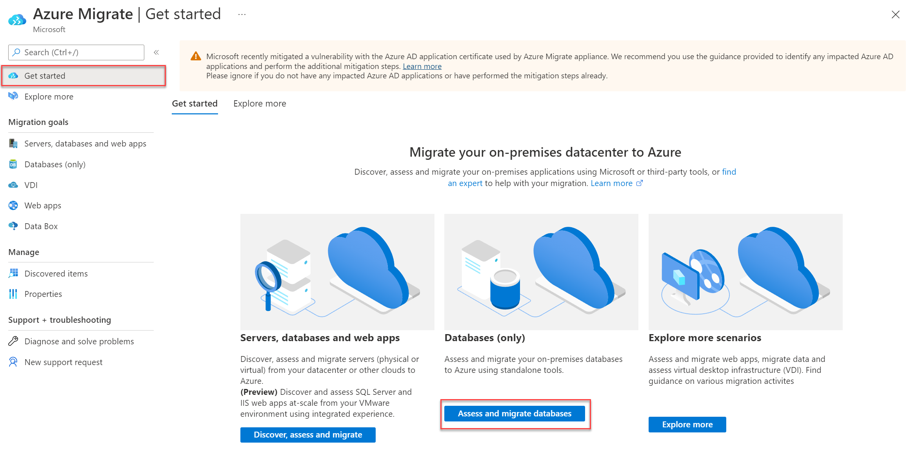  

2. Beneath the **Assessment tools** header, select the **Click here** link to add an assessment tool.

    

3. Select **Azure Migrate: Database Assessment**, then select **Add tool**.

    

4. Under the **Migration tools** header, select the **Click here** link to add a migration tool.

    

5. Select **Azure Migrate: Database Migration**, then select **Add tool**.

    

6. On the **Azure Migrate - Databases (only)** form, select **+ Assess** in **Azure Migrate: Database Assessment** panel.

    

7. From the **Assess databases** blade, select **Download** beneath the **1. Download DMA** header to open the Data Migration Assistant download page. Copy the page URL to the clipboard.

    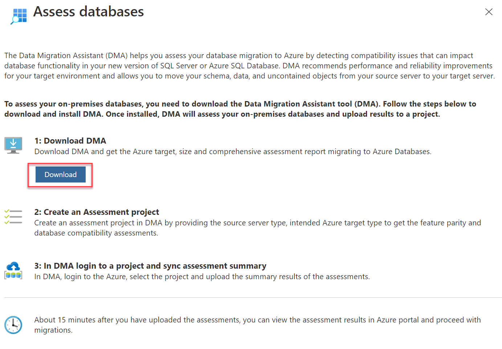

8. Return to your remote desktop session with the **SmartHotelHost** VM. Open **Chrome** from the desktop. Access the .NET Framework 4.8 installation page <https://dotnet.microsoft.com/download/dotnet-framework/net48>, then download and install the runtime. The machine will require a reboot after installation. Reconnect to the **SmartHotelHost** VM after it has rebooted.

    

9. On the **SmartHotelHost** VM, open **Chrome** and paste the Data Migration Assistant download URL into the address bar. Download and install the Data Migration Assistant. **Do not launch the application yet**.

10. From within **SmartHotelHost**, open **Windows Explorer** and navigate to the **C:\\Program Files\\Microsoft Data Migration Assistant** folder. Open the **Dma.exe.config** file using Notepad. Search (<kbd>CTRL</kbd> + <kbd>F</kbd>) for **Azure Migrate** and remove the **\<\!--** and **--\>** around the line setting the **EnableAssessmentUploadToAzureMigrate** key. **Save** the file and close Notepad when done.

    

11. From within **SmartHotelHost** launch **Microsoft Data Migration Assistant** using the desktop icon.

12. In the Data Migration Assistant, select the **+ New** icon.  Fill in the project details as follows:

    - Project type: **Assessment**
  
    - Project name: **SmartHotelAssessment**
  
    - Assessment type: **Database Engine**
  
    - Source server type: **SQL Server**
  
    - Target server type: **Azure SQL Database**

13. Select **Create** to create the project.

    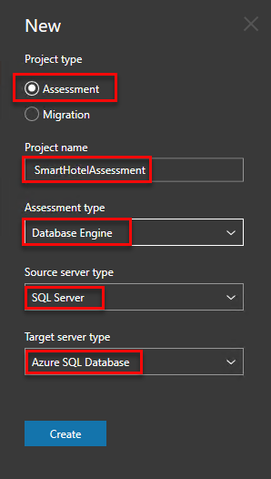

14. On the **Options** tab select **Next**.

15. On the **Select sources** page, in the **Connect to a server** blade, provide the connection details to the SQL Server, and then select **Connect**.

    - Server name: **192.168.0.6**
  
    - Authentication type: **SQL Server Authentication**
  
    - Username: **sa**
  
    - Password: **demo!pass123**
  
    - Encrypt connection: **Checked**
  
    - Trust server certificate: **Checked**

    

16. In the **Add sources** blade, select **SmartHotel.Registration**, then select **Add**.

    

17. Select **Start Assessment** to start the assessment.

    

18. **Wait** for the assessment to complete, and review the results. The results should show one unsupported feature, **Service Broker feature is not supported in Azure SQL Database**. For this migration, you can ignore this issue.

    > **Note**: For Azure SQL Database, the assessments identify feature parity issues and migration blocking issues.

    >- The SQL Server feature parity category provides a comprehensive set of recommendations, alternative approaches available in Azure, and mitigating steps to help you plan the effort into your migration projects.

    >- The Compatibility issues category identifies partially supported or unsupported features that reflect compatibility issues that might block migrating on-premises SQL Server database(s) to Azure SQL Database. Recommendations are also provided to help you address those issues.

19. Select **Upload to Azure Migrate** to upload the database assessment to your Azure Migrate project (this button may take a few seconds to become enabled).

    

20. Select **Azure** from the dropdown on the right then select **Connect**. Enter your subscription credentials when prompted. Select your **Subscription** and **Azure Migrate Project** using the dropdowns, then select **Upload**. Once the upload is complete, select **OK** to dismiss the notification.

    

21. Minimize the remote desktop window and return to the **Azure Migrate - Databases (only)** blade in the Azure portal. Refreshing the page should now show the assessed database.

    

#### Task summary

In this task you used Data Migration Assistant to assess an on-premises database for readiness to migrate to Azure SQL, and uploaded the assessment results to your Azure Migrate project. The DMA is integrated with Azure Migrate providing a single hub for assessment and migration tools.

### Task 4: Create a DMS migration project

In this task you will create a Migration Project within the Azure Database Migration Service (DMS). This project contains the connection details for both the source and target databases. In order to connect to the target database, you will also create a private endpoint allowing connectivity from the subnet used by the DMS.

In subsequent tasks, you will use this project to migrate both the database schema and the data itself from the on-premises SQL Server database to the Azure SQL Database.

We'll start by creating the private endpoint that allows the DMS to access the database server.

1. In the [Azure portal](https://portal.azure.com/), navigate to the **SmartHotelRG** resource group, and then select the SQL server from the list of resources.

2. Select **Networking** under **Security** in the left-hand navigation menu, select the **Private access** tab on the Networking blade, and then select **Create a private endpoint** under _Private endpoint connections_.

    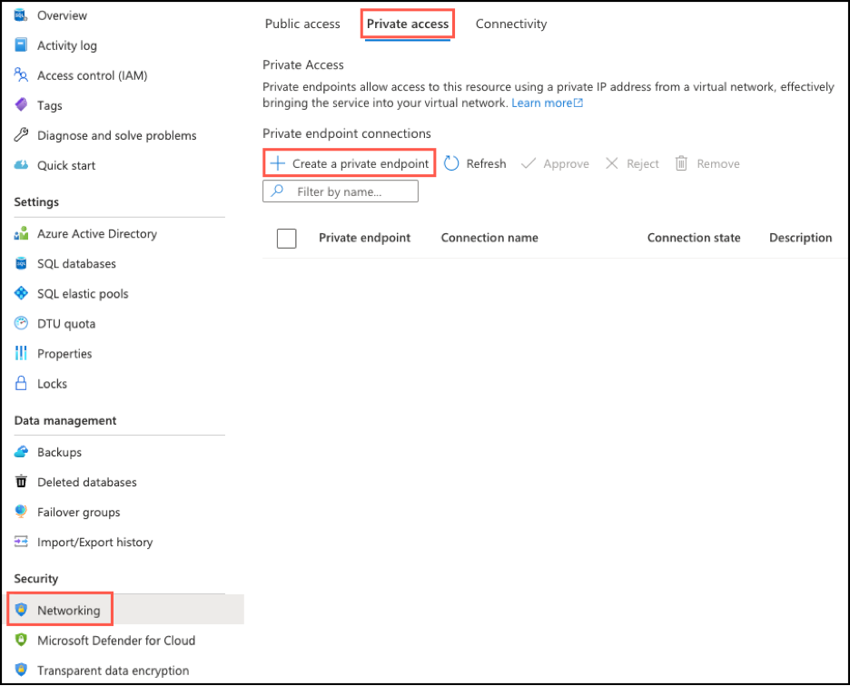

3. On the **Basics** tab that appears, enter the following configuration then select **Next: Resource**.

    - Resource group: **SmartHotelRG**
  
    - Name: **SmartHotel-DB-for-DMS**
  
    - Region: **Select the same location as the DMSvnet (Should be the region closest to you)**.
  
    

4. On the **Resource** tab, enter the following configuration then select **Next: Virtual Network**.

    - Connection method: **Connect to an Azure resource in my directory**.
  
    - Subscription: **Select your subscription**.
  
    - Resource type: **Microsoft.Sql/servers**
  
    - Resource: **Your SQL database server name**.
  
    - Target sub-resource: **sqlServer**

    

5. On the **Virtual Network** tab enter the following configuration then select **Next: Tags**, followed by **Review + create**, and then **Create**.

    - Virtual network: **DMSvnet**
  
    - Subnet: **DMS (10.1.0.0/24)**
  
    - Integrate with private DNS zone: **Yes**
  
    - Private DNS zones: (default) **privatelink.database.windows.net**

    

6. **Wait** for the deployment to complete. Open the Private Endpoint blade, and note that the FQDN for the endpoint is listed as **\<your database\>.database.windows.net**, with an internal IP address **10.1.0.5**.

    

    

    

    

    >**Note**: Private DNS is used so that the database domain name, **\<your server\>.database.windows.net** resolves to the internal private endpoint IP address **10.1.0.5** when resolved from the DMSvnet, but resolves to the Internet-facing IP address of the database server when resolved from outside the DMSvnet. This means the same connection string (which contains the domain name) can be used in both cases.

7. Return to the Database server blade. Under **Security**, select **Firewalls and virtual networks**. Set 'Deny public network access' to **Yes**, then **Save** your changes.

    

8. Check that the Database Migration Service resource you created in task 3 has completed provisioning. You can check the deployment status from the **Deployments** pane in the **AzureMigrateRG** resource group blade.

    

9. Navigate to the Database Migration Service resource blade in the **AzureMigrateRG** resource group and select **+ New Migration Project**.

    

10. On the **New migration project** blade, enter **DBMigrate** as the project name. Leave the source server type as **SQL Server** and target server type as **Azure SQL Database**. Select **Choose type of activity** and select **Create project only** and then select **Create**.

    

11. The Migration Wizard opens, showing the **Select source** step. Complete the settings as follows, then select **Next: Select databases**.

    - Source SQL Server instance name: **10.0.0.4**
  
    - Authentication type: **SQL Authentication**
  
    - User Name: **sa**
  
    - Password: **demo!pass123**

    - Encryption connection: **Checked**
  
    - Trust server certificate: **Checked**

    

    > **Note**: The DMS service connects to the Hyper-V host, which has been pre-configured with a NAT rule to forward incoming SQL requests (TCP port 1433) to the SQL Server VM. In a real-world migration, the SQL Server VM would most likely have its own IP address on the internal network, via an external Hyper-V switch.
    >
    > The Hyper-V host is accessed via its private IP address (10.0.0.4). The DMS service accesses this IP address over the peering connection between the DMS VNet and the SmartHotelHost VNet. This simulates a VPN or ExpressRoute connection between a DMS VNet and an on-premises network.

12. In the **Select databases** step, the **Smarthotel.Registration** database should already be selected. Select **Next: Select target**.

    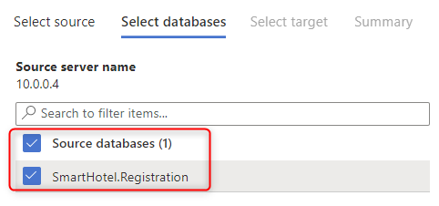

13. Complete the **Select target** step as follows, then select **Next: Summary**:

    - Target server name: **Value from your database, {something}.database.windows.net**.
  
    - Authentication type: **SQL Authentication**
  
    - User Name: **demouser**
  
    - Password: **demo!pass123**
  
    - Encrypt connection: **Checked**

    

    > **Note**: You can find the target server name in the Azure portal by browsing to your database.

    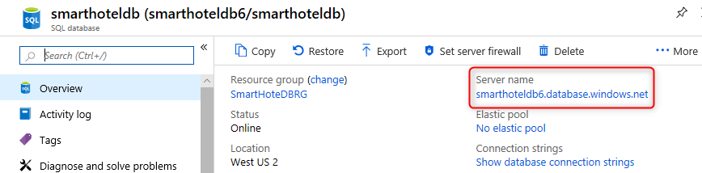

14. At the **Project summary** step, review the settings and select **Save project** to create the migration project.

    

#### Task summary

In this task you created a Migration Project within the Azure Database Migration Service. This project contains the connection details for both the source and target databases. A private endpoint was used to avoid exposing the database on a public IP address.

### Task 5: Migrate the database schema

In this task you will use the Azure Database Migration Service to migrate the database schema to Azure SQL Database. This step is a prerequisite to migrating the data itself.

The schema migration will be carried out using a schema migration activity within the migration project created in task 5.

1. Following task 5, the Azure portal should show a blade for the DBMigrate DMS project. Select **+ New Activity** and select **Schema only migration** from the drop-down.

    

2. The Migration Wizard is shown. Most settings are already populated from the existing migration project. At the **Select source** step, re-enter the source database password **demo!pass123**, then select **Next: Select target**.

    

3. At the **Select target** step, enter the password **demo!pass123** and select **Next: Select database and schema**.

    

4. At the **Select database and schema** step, check that the **SmartHotel.Registration** database is selected. Under **Target Database** select **smarthoteldb** and under **Schema Source** select **Generate from source**. Select **Next: Summary**.

    

5. At the **Summary** step, enter **SchemaMigration** as the **Activity name**. Select **Start migration** to start the schema migration process.

    

6. The schema migration will begin. Select the **Refresh** button and watch the migration progress, until it shows as **Completed**.

    

#### Task summary

In this task you used a schema migration activity in the Azure Database Migration Service to migrate the database schema from the on-premises SQL Server database to the Azure SQL database.

### Task 6: Migrate the on-premises data

In this task you will use the Azure Database Migration Service to migrate the database data to Azure SQL Database.

The schema migration will be carried out using an offline data migration activity within the migration project created in task 5.

1. Return to the Azure portal blade for your **DBMigrate** migration project in DMS. Select **+ New Activity** and select **Data migration** from the drop-down.

    

2. The Migration Wizard is shown. Most settings are already populated from the existing migration project. At the **Select source** step, re-enter the source database password **demo!pass123**, then select **Next: Select database**.

    

3. At the **Select databases** step, select the **SmartHotel.Registration** databases on the source SQL Server, then select **Next: Select target**.

    

4. At the **Select target** step, enter the password **demo!pass123** and select **Next: Map to target databases**.

    

5. At the **Map to target databases** step, check the **SmartHotel.Registration** database. Under **Target Database** select **smarthoteldb**. Select **Next: Configure migration settings**.

    

6. The **Configure migration settings** step allows you to specify which tables should have their data migrated. Select the **Bookings** table (Make sure the **MigrationHistory** table is not checked) and select **Next: Summary**.

    

7. At the **Migration summary** step, enter **DataMigration** as the **Activity name**. Select **Start migration**.

    

8. The data migration will begin. Select the **Refresh** button and watch the migration progress, until it shows as **Completed**.

    

    As a final step, we will remove the private endpoint that allows the DMS service access to the database, since this access is no longer required.

9. In the Azure portal, navigate to the **SmartHotelRG** resource group, and then to the database server. Under **Security**, select **Private endpoint connections**.

10. Select the **SmartHotel-DB-for-DMS** endpoint added earlier, and select **Remove**, followed by **Yes**.

    

#### Task summary

In this task you used an off-line data migration activity in the Azure Database Migration Service to migrate the database data from the on-premises SQL Server database to the Azure SQL database.

#### Exercise summary

In this exercise you migrated the application database from on-premises to Azure SQL Database. The Microsoft Data Migration Assistant was used for migration assessment, and the Azure Database Migration Service was used for schema migration and data migration.

## Exercise 3: Migrate the application and web tiers using Azure Migrate: Server Migration

Duration: 90 minutes

In this exercise you will migrate the web tier and application tiers of the application from on-premises to Azure using Azure Migrate: Server Migration.

Having migrated the virtual machines, you will reconfigure the application tier to use the application database hosted in Azure SQL. This will enable you to verify that the migration application is working end-to-end.

### Task 1: Create a Storage Account

In this task you will create a new Azure Storage Account that will be used by Azure Migrate: Server Migration for storage of your virtual machine data during migration.

> **Note:** This lab focuses on the technical tools required for workload migration. In a real-world scenario, more consideration should go into the long-term plan prior to migrating assets. The landing zone required to host VMs should also include considerations for network traffic, access control, resource organization, and governance. For example, the CAF Migration Blueprint and CAF Foundation Blueprint can be used to deploy a pre-defined landing zone, and demonstrate the potential of an Infrastructure as Code (IaC) approach to infrastructure resource management. For more information, see [Azure Landing Zones](https://docs.microsoft.com/azure/cloud-adoption-framework/ready/landing-zone/) and [Cloud Adoption Framework Azure Migration landing zone Blueprint sample](https://docs.microsoft.com/azure/governance/blueprints/samples/caf-migrate-landing-zone/).

1. In the Azure portal's left navigation, select **+ Create a resource**, then search for and select **Storage account**, followed by **Create**.

    

2. In the **Create storage account** blade, on the **Basics** tab, use the following values:

    - Subscription: **Select your Azure subscription**.
    - Resource group: **AzureMigrateRG**
    - Storage account name: **migrationstorage\[unique number\]**
    - Location: **IMPORTANT: Select the same location as your Azure SQL Database** (can be found in the Azure portal).
    - Performance: **Standard**
    - Replication: **Locally-redundant storage (LRS)**

      

3. Select the **Data protection** tab, and uncheck the **Enable soft delete blobs**:

    

4. Select **Review + create**, then select **Create**.

#### Task summary

In this task you created a new Azure Storage Account that will be used by Azure Migrate: Server Migration.

### Task 2: Create a Private Endpoint

In this task you will create an endpoint on the provided virtual network that will be used by the SQL Server resource.

> **Note:** Azure provides several options for deploying the right network configuration. After the lab, if you’d like to better understand your networking options, see the [network decision guide](https://docs.microsoft.com/azure/cloud-adoption-framework/decision-guides/software-defined-network/), which builds on the Cloud Adoption Framework’s Azure landing zones.

You will also configure a private endpoint in this network to allow private, secure access to the SQL Database.

1. 1. In the [Azure portal](https://portal.azure.com/), navigate to the **SmartHotelRG** resource group, and then select the SQL server from the list of resources.

2. Select **Networking** under **Security** in the left-hand navigation menu, select the **Private access** tab on the Networking blade, and then select **Create a private endpoint** under _Private endpoint connections_.

    

3. On the **Basics** tab, enter the following configuration then select **Next: Resource**:

    - Resource group: **SmartHotelRG**
  
    - Name: **SmartHotel-DB-Endpoint**
  
    - Region: **Select the same location as the SmartHotelVNet**.
  
    

4. On the **Resource** tab, enter the following configuration then select **Next: Virtual Network**:

    - Connection method: **Connect to an Azure resource in my directory**.
  
    - Subscription: **Select your subscription**.
  
    - Resource type: **Microsoft.Sql/servers**
  
    - Resource: **Your SQL database server**.
  
    - Target sub-resource: **sqlServer**

    

5. On the **Virtual Network** tab, enter the following configuration then select, **Next:Tags**, followed by **Review + Create**, and then **Create**:

    - Virtual network: **SmartHotelVNet**
  
    - Subnet: **SmartHotelDB (192.168.0.128/25)**
  
    - Integrate with private DNS zone: **Yes**
  
    - Private DNS zone: (default) **privatelink.database.windows.net**

    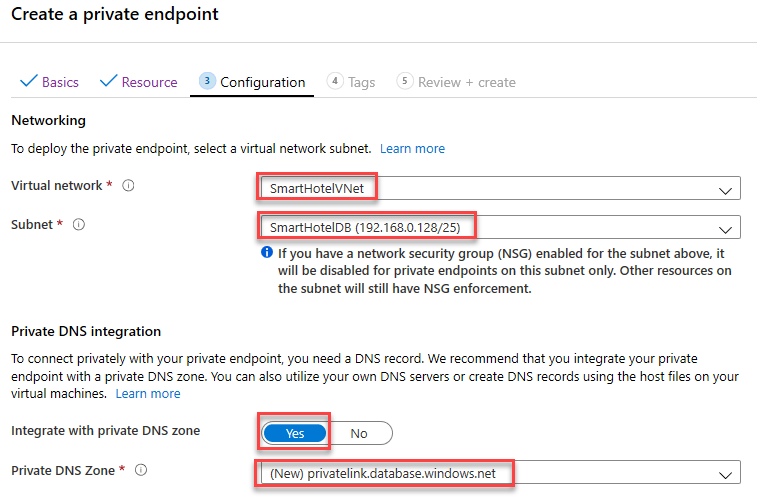

6. **Wait** for the deployment to complete. Open the Private Endpoint blade, and note that the FQDN for the endpoint is listed as **\<your database\>.database.windows.net**, with an internal IP address **192.168.0.132**.

    

    

    

    >**Note**: Private DNS is used so that the database domain name, **\<your server\>.database.windows.net** resolves to the internal private endpoint IP address **192.168.0.132** when resolved from the SmartHotelVNet, but resolves to the Internet-facing IP address of the database server when resolved from outside the VNet. This means the same connection string (which contains the domain name) can be used in both cases.

    >**Note**: If the private endpoint connection fails to allow the IP address or database domain name to connect to the database, it may be required to create a new firewall rule to allow the IP address ranges of the database and the private link.

#### Task summary

In this task you created a private endpoint on the virtual network that will be used  to access the SQL database.

### Task 3: Register the Hyper-V Host with Azure Migrate: Server Migration

In this task, you will register your Hyper-V host with the Azure Migrate: Server Migration service. This service uses Azure Site Recovery as the underlying migration engine. As part of the registration process, you will deploy the Azure Site Recovery Provider on your Hyper-V host.

1. Return to the **Azure Migrate** blade in the Azure Portal, and select **Servers, databases and web apps** under **Migration goals** on the left. Under **Migration Tools**, select **Discover**.

    **Note:** You may need to add the migration tool yourself by following the link below the **Migration Tools** section, selecting **Azure Migrate: Server Migration**, then selecting **Add tool(s)**.

    

2. In the **Discover machines** panel, under **Are your machines virtualized**, select **Yes, with Hyper-V**. Under **Target region** enter **the same region as used for your Azure SQL Database** which can be found in the Azure portal and check the confirmation checkbox. Select **Create resources** to begin the deployment of the Azure Site Recovery resource used by Azure Migrate: Server Migration for Hyper-V migrations.

    

    Once deployment is complete, the 'Discover machines' panel should be updated with additional instructions.
  
3. Copy the **Download** link for the Hyper-V replication provider software installer to your clipboard.

    

4. Open the **SmartHotelHost** remote desktop window, launch **Chrome** from the desktop shortcut, and paste the link into a new browser tab to download the Azure Site Recovery provider installer.

5. Return to the **Discover machines** page in your browser (outside the SmartHotelHost remote desktop session). Select the blue **Download** button and download the registration key file.

    

6. Open the file location in Windows Explorer, and copy the file to your clipboard. Return to the **SmartHotelHost** remote desktop session and paste the file to the desktop.

7. Still within the **SmartHotelHost** remote desktop session, open the **AzureSiteRecoveryProvider.exe** installer you downloaded a moment ago. On the **Microsoft Update** tab, select **Off** and select **Next**. Accept the default installation location and select **Install**.

    

8. When the installation has completed select **Register**. Browse to the location of the key file you downloaded. When the key is loaded select **Next**.

    

9. Select **Connect directly to Azure Site Recovery without a proxy server** and select **Next**. The registration of the Hyper-V host with Azure Site Recovery will begin.

10. Wait for registration to complete (this may take several minutes). Then select **Finish**.

    

11. Minimize the SmartHotelHost remote desktop session and return to the Azure Migrate browser window. **Refresh** your browser, then re-open the **Discover machines** panel by selecting **Discover** under **Azure Migrate: Server Migration** and selecting **Yes, with Hyper-V** for **Are your machines virtualized?**.

12. Select **Finalize registration**, which should now be enabled.

    

13. Azure Migrate will now complete the registration with the Hyper-V host. **Wait** for the registration to complete. This may take several minutes.

    

14. Once the registration is complete, close the **Discover machines** panel.

    

15. The **Azure Migrate: Server Migration** panel should now show 5 discovered servers.

    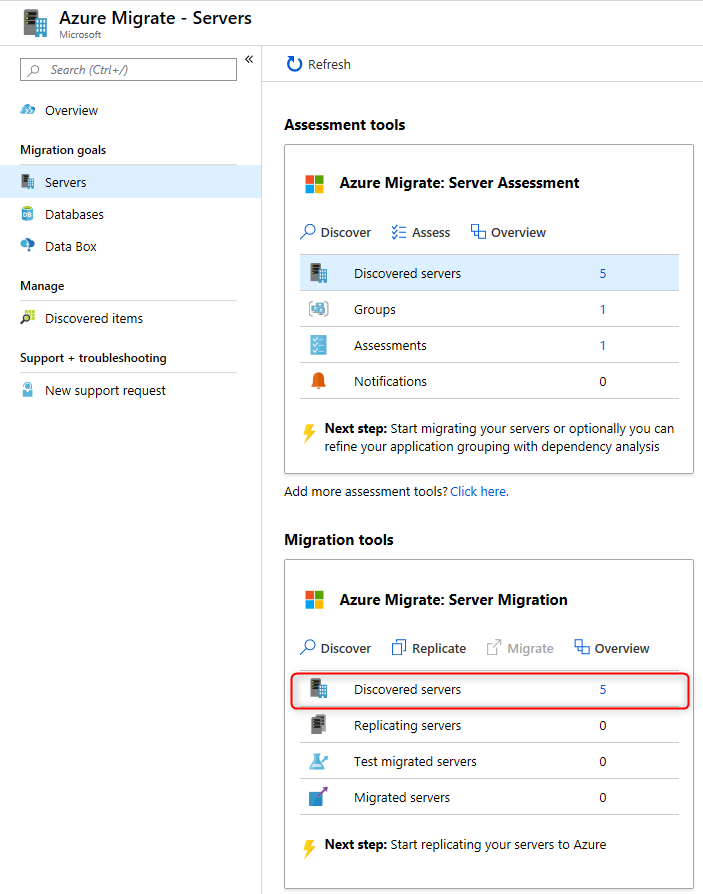

#### Task summary

In this task you registered your Hyper-V host with the Azure Migrate Server Migration service.

### Task 4: Enable Replication from Hyper-V to Azure Migrate

In this task, you will configure and enable the replication of your on-premises virtual machines from Hyper-V to the Azure Migrate Server Migration service.

1. Under **Azure Migrate: Server Migration**, select **Replicate**. This opens the **Replicate** wizard.

    

2. In the **Source settings** tab, under **Are your machines virtualized?**, select **Yes, with Hyper-V** from the drop-down. Then select **Next**.

    

3. In the **Virtual machines** tab, under **Import migration settings from an assessment**, select **Yes, apply migration settings from an Azure Migrate assessment**. Select the **SmartHotel VMs** VM group and the **SmartHotelAssessment** migration assessment.

    

4. The **Virtual machines** tab should now show the virtual machines included in the assessment. Select the **UbuntuWAF**, **smarthotelweb1**, and **smarthotelweb2** virtual machines, then select **Next**.

    

5. In the **Target settings** tab, select your subscription and the existing **SmartHotelRG** resource group. Under **Replication storage account** select the **migrationstorage...** storage account and under **Virtual Network** select **SmartHotelVNet**. Under **Subnet** select **SmartHotel**. Select **Next**.

    

    > **Note:** For simplicity, in this lab you will not configure the migrated VMs for high availability, since each application tier is implemented using a single VM.

6. In the **Compute** tab, select the **Standard_F2s_v2** VM size for each virtual machine. Select the **Windows** operating system for the **smarthotelweb** virtual machines and the **Linux** operating system for the **UbuntuWAF** virtual machine. Select **Next**.

    > **Note**: If you are using an Azure Pass subscription, your subscription may not have a quota allocated for FSv2 virtual machines. In this case, use **DS2_v2 or D2s_v3** virtual machines instead.

    

7. In the **Disks** tab, review the settings but do not make any changes. Select **Next** twice, then select **Replicate** to start the server replication.

8. In the **Azure Migrate Servers, databases and web apps** blade, under **Azure Migrate: Server Migration**, select the **Overview** button.

    

9. Confirm that the 3 machines are replicating.

    

10. Select **Replicating Machines** under **Manage** on the left.  Select **Refresh** occasionally and wait until all three machines have a **Protected** status, which shows the initial replication is complete. This will take several minutes.

    

#### Task summary

In this task you enabled replication from the Hyper-V host to Azure Migrate, and configured the replicated VM size in Azure.

### Task 5: Configure static internal IP addresses for each VM

In this task you will modify the settings for each replicated VM to use a static private IP address that matches the on-premises IP addresses for that machine.

1. Still using the **Azure Migrate: Server Migration - Replicating machines** blade, select the **smarthotelweb1** virtual machine. This opens a detailed migration and replication blade for this machine. Take a moment to study this information.

    

2. Select **Compute and Network** under **General** on the left, then select **Edit**.

   

3. Confirm that the VM is configured to use the **F2s_v2** VM size (or **DS2_v2 or D2s_v3** if using an Azure Pass subscription) and that **Use managed disks** is set to **Yes**.

4. Under **Network Interfaces**, select **InternalNATSwitch** to open the network interface settings.

    

5. Change the **Private IP address** to **192.168.0.4**.

    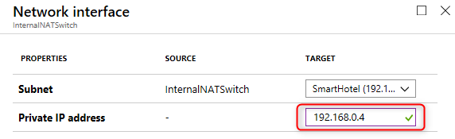

6. Select **OK** to close the network interface settings blade, then **Save** the **smarthotelweb1** settings.

7. Repeat these steps to configure the private IP address for the other VMs.

    - For **smarthotelweb2** use private IP address **192.168.0.5**  
    - For **UbuntuWAF** use private IP address **192.168.0.8**

#### Task summary

In this task you modified the settings for each replicated VM to use a static private IP address that matches the on-premises IP addresses for that machine

> **Note**: Azure Migrate makes a "best guess" at the VM settings, but you have full control over the settings of migrated items. In this case, setting a static private IP address ensures the virtual machines in Azure retain the same IPs they had on-premises, which avoids having to reconfigure the VMs during migration (for example, by editing web.config files).

### Task 6: Server migration

In this task you will perform a migration of the UbuntuWAF, smarthotelweb1, and smarthotelweb2 machines to Azure.

> **Note**: In a real-world scenario, you would perform a test migration before the final migration. To save time, you will skip the test migration in this lab. The test migration process is very similar to the final migration.

1. Return to the **Azure Migrate: Server Migration** overview blade. Under **Step 3: Migrate**, select **Migrate**.

    

2. On the **Migrate** blade, select the 3 virtual machines then select **Migrate** to start the migration process.

    

    > **Note**: You can optionally choose whether the on-premises virtual machines should be automatically shut down before migration to minimize data loss. Either setting will work for this lab.

3. The migration process will start.

    

4. To monitor progress, select **Jobs** under **Manage** on the left and review the status of the three **Planned failover** jobs.

    

5. **Wait** until all three **Planned failover** jobs show a **Status** of **Successful**. You should not need to refresh your browser. This could take up to 15 minutes.

    

6. Navigate to the **SmartHotelRG** resource group and check that the VM, network interface, and disk resources have been created for each of the virtual machines being migrated.

   

#### Task summary

In this task you used Azure Migrate to create Azure VMs using the settings you have configured, and the data replicated from the Hyper-V machines. This migrated your on-premises VMs to Azure.

### Task 7: Configure the database connection

The application tier machine **smarthotelweb2** is configured to connect to the application database running on the **smarthotelsql** machine.

On the migrated VM **smarthotelweb2**, this configuration needs to be updated to use the Azure SQL Database instead.

> **Note**: You do not need to update any configuration files on **smarthotelweb1** or the **UbuntuWAF** VMs, since the migration has preserved the private IP addresses of all virtual machines they connect with.

1. Navigate to the **smarthotelweb2** VM overview blade, and select **Connect**. Select **Bastion** and connect to the machine with the username **Administrator** and the password **demo!pass123** (note that the popup blocker of your web browser must be disabled in order to connect). When prompted, **Allow** clipboard access.

    **Note:** You may have to wait a few minutes and refresh to have the option to enter the credentials.

    

2. In the **smarthotelweb2** remote desktop session, open Windows Explorer and navigate to the **C:\\inetpub\\SmartHotel.Registration.Wcf** folder. Double-select the **Web.config** file and open with Notepad.

3. Update the **DefaultConnection** setting to connect to your Azure SQL Database.

    You can find the connection string for the Azure SQL Database in the Azure portal by browsing to the database, and selecting **Show database connection strings**.

     

    Copy the **ADO.NET** connection string, and paste into the web.config file on **smarthotelweb2**, replacing the existing connection string.  **Be careful not to overwrite the 'providerName' parameter which is specified after the connection string.**

    > **Note:** You may need to open the clipboard panel on the left-hand edge of the Bastion window, paste the connection string there, and then paste into the VM.

    Set the password in the connection string to **demo!pass123**.

    

4. **Save** the `web.config` file and exit your Bastion remote desktop session.

    > **Note**: You also need to associate the virtual network hosting the Azure VMs **smarthotelweb1** and **smarthotelweb2** with the Azure Private DNS zone hosting the DNS record associated with the logical server of the target Azure SQL Database.

5. In the Azure portal, navigate to the blade of the **privatelink.database.windows.net** Private DNS zone in the **SmartHotelRG** resource group.

6. On the **privatelink.database.windows.net** blade, select **Virtual network links**.

7. Select **Virtual network links** under the **Settings** section and then select **+ Add**.

8. On the **Add virtual network link** blade, in the **Link name** text box, enter **SmartHotelVNet**, in the **Virtual network** drop-down list, select **SmartHotelVNet**, and then select **OK**.

#### Task summary

In this task, you updated the **smarthotelweb2** and **privatelink.database.windows.net** configuration to connect to the Azure SQL Database.

### Task 8: Configure the public IP address and test the SmartHotel application

In this task, you will associate an Application Gateway with Web Application Firewall (WAF) to replace the Ubuntu VM with the Azure managed service.

1. Navigate to the **SmartHotel-WAF** Application Gateway in the **SmartHotelRG** resource group

2. Select **Backend pools** under the Settings section, and select the **WebBackend** pool

    

3. Set the Target type to **Virtual machine** and the Target to the NIC of **smarthotelweb1**; select **Save** to update the backend pool

    

    > **Note:** This backend pool is already associated with the front-end IP address of the Application Gateway via the SmartHotelApp rule. The front-end IP, listener, rule, and backend pool were all created with the Application Gateway. This step now ties the migrated VM to the front end.

4. Navigate to the **Frontend IP configurations** of the Application Gateway in the Settings section, and note the IP address associated with the public IP address **appGwPublicFrontendIp**.

    

5. Open a new browser tab and paste the IP address into the address bar. Verify that the SmartHotel360 application is now available in Azure.

    

    > **Note:** At this point the base Application Gateway service is providing access to the backend application. This validates that the application is working and can be further protected by the WAF in the following steps.
    >
    > **If the browser does not show the application, troubleshoot your connection before proceeding to the next steps.** A Bastion service is deployed with the landing zone template to assist in accessing VMs on the SmartHotelVNet if needed for troubleshooting.

6. Select **Web application firewall** under the Settings section and change the Tier to **WAF V2**.  Also, change the Firewall status to **Enabled**, the Firewall mode to **Prevention**, and set the Max request body size (KB) to **32**.  Select **Save** to commit the changes.

    

7. Once the application gateway changes have been saved, go back to your web browser with the public IP address of the application gateway you used earlier and refresh the browser to have a page processed by the WAF.

#### Task summary

In this task, you associated the web app running on the VM to the application gateway, enabled the Web Application Firewall v2 (WAF v2), and verified that the SmartHotel application is now working in Azure.

### Task 9: Post-migration steps

There are a number of post-migration steps that should be completed before the migrated services are ready for production use. These include:

- Installing the Azure VM Agent
- Cleaning up migration resources
- Enabling backup and disaster recovery
- Encrypting VM disks
- Ensuring the network is properly secured
- Ensuring proper subscription governance is in place, such as role-based access control and Azure Policy
- Reviewing recommendations from Azure Advisor and Security Center

In this task you will install the Azure Virtual Machine Agent (VM Agent) on your migrated Azure VMs and clean up any migration resources. The remaining steps are common for any Azure application, not just migrations, and are therefore out of scope for this hands-on lab.

> **Note**: The Microsoft Azure Virtual Machine Agent (VM Agent) is a secure, lightweight process that manages virtual machine (VM) interaction with the Azure Fabric Controller. The VM Agent has a primary role in enabling and executing Azure virtual machine extensions. VM Extensions enable post-deployment configuration of VM, such as installing and configuring software. VM extensions also enable recovery features such as resetting the administrative password of a VM. Without the Azure VM Agent, VM extensions cannot be used.
>
> In this lab, you will install the VM agent on the Azure VMs after migration. Alternatively, you could instead install the agent on the VMs in Hyper-V before migration.

1. In the Azure portal, locate the **smarthotelweb1** VM and open a remote desktop session using Azure Bastion. Log in to the **Administrator** account using password **demo!pass123** (use the 'eyeball' to check the password was entered correctly with your local keyboard mapping).

2. Open a web browser and download the VM Agent from:

    ```s
    https://go.microsoft.com/fwlink/?LinkID=394789
    ```

    **Note**: You may need to open the clipboard panel on the left-hand edge of the Bastion window, paste the URL, and then paste into the VM.

3. After the installer has downloaded, run it. Select **Next**, Select **I accept the terms in the License Agreement**, and then **Next** again. Select **Finish**.

    

4. Close the smarthotelweb1 window. Repeat the Azure VM agent installation process on **smarthotelweb2**.

   You will now install the Linux version of the Azure VM Agent on the Ubuntu VM. All Linux distributions supported by Azure have integrated the Azure VM Agent into their software repositories, making installation easy in most cases.

5. In the Azure portal, locate the **UbuntuWAF** VM and **Connect** to the VM using Azure Bastion, with the user name **demouser** and password **demo!pass123**. Since this is a Linux VM, Bastion will create an SSH session. You may need to enter the credentials again.

6. In the SSH session, enter the following command:

    ```s
    sudo apt-get install walinuxagent
    ```

    When prompted, enter the password **demo!pass123**. At the _Do you want to continue?_ prompt, type **Y** and press **Enter**.

    **Note**: You may need to open the clipboard panel on the left-hand edge of the Bastion window, paste the command, and then paste into the VM.

    

7. Wait for the installer to finish, then close the terminal window and the Ubuntu VM window.

   To demonstrate that the VM Agent is installed, we will now execute the 'Run command' feature from the Azure portal. For more information on the VM Agent, see [Windows VM Agent](https://docs.microsoft.com/azure/virtual-machines/extensions/agent-windows) and [Linux VM Agent](https://docs.microsoft.com/azure/virtual-machines/extensions/agent-linux).

8. Navigate to the **smarthotelweb1** blade. Under **Operations**, select **Run command**, followed by **IPConfig**, followed by **Run**. After a few seconds, you should see the output of the IPConfig command.

    

9. As a final step, you will now clean up the resources that were created to support the migration and are no longer needed. These include the Azure Migrate project, the Recovery Service Vault (Azure Site Recovery resource) used by  Azure Migrate: Server Migration, and the Database Migration Service instance. Also included are various secondary resources such as the Log Analytics workspace used by the Dependency Visualization, the storage account used by Azure Migrate: Server Migration, and a Key Vault instance.

    Because all of these temporary resources have been deployed to a separate **AzureMigrateRG** resource group, deleting them is as simple as deleting the resource group. Simply navigate to the resource group blade in the Azure portal, select **Delete resource group** and complete the confirmation prompts.

#### Task summary

In this task you installed the Azure Virtual Machine Agent (VM Agent) on your migrated VMs. You also cleaned up the temporary resources created during the migration process.

### Exercise summary

In this exercise you migrated the web tier and application tiers of the application from on-premises to Azure using Azure Migrate: Server Migration. Having migrated the virtual machines, you reconfigured the application tier to use the migrated application database hosted in Azure SQL Database, and verified that the migrated application is working end-to-end. You also installed the VM Agent on the migrated virtual machines, and cleaned up migration resources.

## After the hands-on lab

Duration: 10 minutes

### Task 1: Clean up resources

You should complete all of these steps _after_ attending the Hands-on lab. Failure to delete the resources created during the lab will result in continued billing.

1. Delete the **SmartHotelHostRG** resource group containing the SmartHotelHost.

2. Delete the **BastionRG** resource group containing the Azure Bastion.

3. Delete the **SmartHotelRG** resource group containing the migrated VMs and related infrastructure resources.

4. Delete the **AzureMigrateRG** resource group containing the Azure Migrate resources (if not done already at the end of Exercise 3).

You should follow all steps provided _after_ attending the Hands-on lab.
