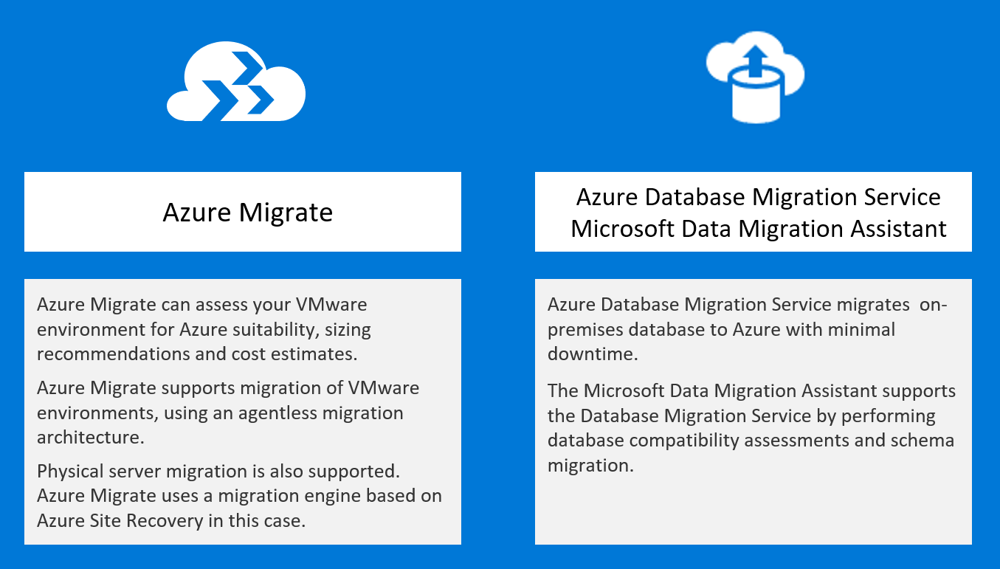

Line-of-business application migration

Whiteboard design session trainer guide

February 2022

Information in this document, including URL and other Internet Web site references, is subject to change without notice. Unless otherwise noted, the example companies, organizations, products, domain names, e-mail addresses, logos, people, places, and events depicted herein are fictitious, and no association with any real company, organization, product, domain name, e-mail address, logo, person, place or event is intended or should be inferred. Complying with all applicable copyright laws is the responsibility of the user. Without limiting the rights under copyright, no part of this document may be reproduced, stored in or introduced into a retrieval system, or transmitted in any form or by any means (electronic, mechanical, photocopying, recording, or otherwise), or for any purpose, without the express written permission of Microsoft Corporation.

Microsoft may have patents, patent applications, trademarks, copyrights, or other intellectual property rights covering subject matter in this document. Except as expressly provided in any written license agreement from Microsoft, the furnishing of this document does not give you any license to these patents, trademarks, copyrights, or other intellectual property.

The names of manufacturers, products, or URLs are provided for informational purposes only and Microsoft makes no representations and warranties, either expressed, implied, or statutory, regarding these manufacturers or the use of the products with any Microsoft technologies. The inclusion of a manufacturer or product does not imply endorsement of Microsoft of the manufacturer or product. Links may be provided to third party sites. Such sites are not under the control of Microsoft and Microsoft is not responsible for the contents of any linked site or any link contained in a linked site, or any changes or updates to such sites. Microsoft is not responsible for webcasting or any other form of transmission received from any linked site. Microsoft is providing these links to you only as a convenience, and the inclusion of any link does not imply endorsement of Microsoft of the site or the products contained therein.

© 2022 Microsoft Corporation. All rights reserved.

Microsoft and the trademarks listed at <https://www.microsoft.com/en-us/legal/intellectualproperty/Trademarks/Usage/General.aspx> are trademarks of the Microsoft group of companies. All other trademarks are property of their respective owners.

**Contents**

<!-- TOC -->

- [Trainer information](#trainer-information)
  - [Role of the trainer](#role-of-the-trainer)
  - [Whiteboard design session flow](#whiteboard-design-session-flow)
  - [Before the whiteboard design session: How to prepare](#before-the-whiteboard-design-session-how-to-prepare)
  - [During the whiteboard design session: Tips for an effective whiteboard design session](#during-the-whiteboard-design-session-tips-for-an-effective-whiteboard-design-session)
- [Line-of-business application migration whiteboard design session student guide](#line-of-business-application-migration-whiteboard-design-session-student-guide)
  - [Abstract and learning objectives](#abstract-and-learning-objectives)
  - [Step 1: Review the customer case study](#step-1-review-the-customer-case-study)
    - [Customer situation](#customer-situation)
    - [Customer needs](#customer-needs)
    - [Customer objections](#customer-objections)
    - [Infographic for common scenarios](#infographic-for-common-scenarios)
  - [Step 2: Design a proof of concept solution](#step-2-design-a-proof-of-concept-solution)
  - [Step 3: Present the solution](#step-3-present-the-solution)
  - [Wrap-up](#wrap-up)
  - [Additional references](#additional-references)
- [Line of business application migration whiteboard design session trainer guide](#line-of-business-application-migration-whiteboard-design-session-trainer-guide)
  - [Step 1: Review the customer case study](#step-1-review-the-customer-case-study-1)
  - [Step 2: Design a proof of concept solution](#step-2-design-a-proof-of-concept-solution-1)
  - [Step 3: Present the solution](#step-3-present-the-solution-1)
  - [Wrap-up](#wrap-up-1)
  - [Preferred target audience](#preferred-target-audience)
  - [Preferred solution](#preferred-solution)
  - [Checklist of preferred objection handling](#checklist-of-preferred-objection-handling)
  - [Future proposal](#future-proposal)
  - [Customer quote (to be read back to the attendees at the end)](#customer-quote-to-be-read-back-to-the-attendees-at-the-end)

<!-- /TOC -->

# Trainer information

Thank you for taking time to support the whiteboard design sessions as a trainer!

## Role of the trainer

An amazing trainer:

-   Creates a safe environment in which learning can take place.

-   Stimulates the participant's thinking.

-   Involves the participant in the learning process.

-   Manages the learning process (on time, on topic, and adjusting to benefit participants).

-   Ensures individual participant accountability.

-   Ties it all together for the participant.

-   Provides insight and experience to the learning process.

-   Effectively leads the whiteboard design session discussion.

-   Monitors quality and appropriateness of participant deliverables.

-   Effectively leads the feedback process.

## Whiteboard design session flow 

Each whiteboard design session uses the following flow:

**Step 1: Review the customer case study (15 minutes)**

**Outcome**

Analyze your customer's needs.

-   Customer's background, situation, needs and technical requirements

-   Current customer infrastructure and architecture

-   Potential issues, objectives and blockers

**Step 2: Design a proof of concept solution (60 minutes)**

**Outcome**

Design a solution and prepare to present the solution to the target customer audience in a 15-minute chalk-talk format.

-   Determine your target customer audience.

-   Determine customer's business needs to address your solution.

-   Design and diagram your solution.

-   Prepare to present your solution.

**Step 3: Present the solution (30 minutes)**

**Outcome**

Present solution to your customer:

-   Present solution

-   Respond to customer objections

-   Receive feedback

**Wrap-up (15 minutes)**

-   Review preferred solution

## Before the whiteboard design session: How to prepare

Before conducting your first whiteboard design session:

-   Read the Student guide (including the case study) and Trainer guide.

-   Become familiar with all key points and activities.

-   Plan the point you want to stress, which questions you want to drive, transitions, and be ready to answer questions.

-   Prior to the whiteboard design session, discuss the case study to pick up more ideas.

-   Make notes for later.

## During the whiteboard design session: Tips for an effective whiteboard design session

**Refer to the Trainer guide** to stay on track and observe the timings.

**Do not expect to memorize every detail** of the whiteboard design session.

When participants are doing activities, you can **look ahead to refresh your memory**.

-   **Adjust activity and whiteboard design session pace** as needed to allow time for presenting, feedback, and sharing.

-   **Add examples, points, and stories** from your own experience. Think about stories you can share that help you make your points clearly and effectively.

-   **Consider creating a "parking lot"** to record issues or questions raised that are outside the scope of the whiteboard design session or can be answered later. Decide how you will address these issues, so you can acknowledge them without being derailed by them.

***Have fun**! Encourage participants to have fun and share!*

**Involve your participants.** Talk and share your knowledge but always involve your participants, even while you are the one speaking.

**Ask questions** and get them to share to fully involve your group in the learning process.

**Ask first**, whenever possible. Before launching into a topic, learn your audience's opinions about it and experiences with it. Asking first enables you to assess their level of knowledge and experience, and leaves them more open to what you are presenting.

**Wait for responses**. If you ask a question such as, "What's your experience with (fill in the blank)?" then wait. Do not be afraid of a little silence. If you leap into the silence, your participants will feel you are not serious about involving them and will become passive. Give participants a chance to think, and if no one answers, patiently ask again. You will usually get a response.

#  Line-of-business application migration whiteboard design session student guide

## Abstract and learning objectives 

In this whiteboard design session, you will look at how to design an Azure migration for a heterogenous customer environment. The existing infrastructure comprises both Windows and Linux servers running on both VMWare and physical machines, and includes some legacy servers. Throughout the whiteboard design session, you will look at the various options and services available to migrate heterogenous environments to Azure.

At the end of this workshop, you will be better able to design and implement the discovery and assessment of environments to evaluate their readiness for migrating to Azure using services including Azure Migrate and Azure Database Migration Service.

## Step 1: Review the customer case study 

**Outcome**

Analyze your customer's needs.

Timeframe: 15 minutes

Directions:  With all participants in the session, the facilitator/SME presents an overview of the customer case study along with technical tips.

1.  Meet your team members and trainer.

2.  Read all directions for steps 1-3 in the student guide.

3.  As a team, review the following customer case study.

### Customer situation

Fabrikam Fabrics is a major manufacturer and distributor of clothing and soft furnishing materials. Founded in 1972 and based in Columbus, Ohio, their business comprises three major product families (clothing, upholstery, and technical fabrics). Customers comprise familiar brand-name clothing manufacturers and furniture manufacturers, and also includes large-scale uniform suppliers to the US military. Turnover in 2018 exceeded 350 million USD.

The CTO, James Lynch, was hired 6 months ago from outside the company, with a mandate to address ever-increasing IT costs. He has identified a sprawling IT estate, including a substantial legacy server footprint. New servers and services have been accumulated over time, without consolidating existing infrastructure. This includes:
- Windows servers including both x32 and x64 hardware running Windows Server 2003 through to 2016
- Linux servers running a mix of RHEL 6.10 and 7 series (7.2 through 7.6) and Ubuntu 16.04
- The above servers comprise both physical machines as well as VMs hosted on VMware infrastructure managed by vCenter 6.5
- Multiple database engines, including Microsoft SQL Server, PostgreSQL, and Cassandra
- Multiple services are also supplied by the systems including Firewall (L3-L7), Web Application Firewall, and Domain Name Service (DNS) Zones

In total, 448 servers and VMs have been identified to date, distributed across 5 main locations, all in the US. There is a complex web of dependencies between servers, and no-one has a clear view of the entire estate. Fear of breaking an existing system has been one of the drivers of server count and sprawl.

To address this, James has proposed to the board that Fabrikam should migrate as much of the existing IT infrastructure as possible to the cloud. As well as eliminating IT infrastructure overheads, this will be an opportunity to 'clean house' and create a modern, fit-for-purpose IT environment, as well as realizing substantial cost savings relative to their current infrastructure. The board have agreed, and Microsoft Azure has been selected as the cloud provider.

### Customer needs 

1.  Identify which servers (physical and virtual) can be migrated to Azure, and what modifications (if any) are required.
   
2.  Create a road map of prioritized migrations, accounting for ease of migration and dependencies.

3.  Where suitable, migrate existing servers and databases to Azure as efficiently as possible.
   
4.  Where existing servers cannot be migrated, identify alternative migration strategies (refactor, re-architect, etc.) and their pros/cons.
   
5.  Prior to migration, accurately forecast the costs associated with each migrated workload, including any third-party licensing costs.

6.  Ensure the Azure environment used for the migrated applications follow recommended best practices.
   
7.  Post-migration, be able to track costs, control usage, cross-charge business owners, and identify cost-saving opportunities.

8.  What customer services could be more efficiently run or managed by moving them to Azure PaaS services?

### Customer objections 

1.  Owners of each business application need to approve any substantial application change, including migration. Business owners have indicated that they will require evidence that migration will be successful before granting approval.

2.  Fabrikam have negotiated an Enterprise Agreement (EA) with Microsoft for their Azure consumption. Any cost estimates need to reflect their EA discount.

3.  Many applications comprise multiple components or tiers. How can you ensure that these migrations are appropriately orchestrated?
   
4.  To reduce business impact, each migration should be designed to minimize application downtime. In addition, to reduce risk, there must be an option to fail-back should the migration experience an unexpected problem.

5.  We are expecting to move all our existing infrastructure to Azure. Reducing our on-premises server costs should provide substantial cost savings. Can you confirm what savings we can expect?

### Infographic for common scenarios

## Step 2: Design a proof of concept solution

**Outcome**

Design a solution and prepare to present the solution to the target customer audience in a 15-minute chalk-talk format.

Timeframe: 60 minutes

**Business needs**

Directions: With your team, answer the following questions and be prepared to present your solution to others:

1.  Who will you present this solution to? Who is your target customer audience? Who are the decision makers?

2.  What customer business needs do you need to address with your solution?

**Design**

Directions: With your team, respond to the following questions:

*Migration Assessment*

1.  How can Fabrikam assess their existing infrastructure for migration to Azure? Provide options for VMware VMs, physical servers, and databases.

2.  How can Fabrikam identify dependencies between their existing servers? How can they use this information in their migration planning?
   
3.  What criteria should Fabrikam use to prioritize their migrations when building a migration road map?
   
4.  What options can you suggest to migrate workloads whose current infrastructure is not suitable for a lift-and-shift migration to Azure? 

*Migration Execution*

1.  What Azure components or configurations should be deployed prior to migration? How can this Azure environment be made future-proof and aligned with best practices?

2.  What tools are available for migration execution? Provide options for VMware VMs, physical servers, and databases.
   
2.  What post-migration steps should be carried out for business-critical applications migrated to Azure?  What guidance is available to ensure nothing is missed?

*Cost management and optimization*

1.  How can Fabrikam estimate the future cost before a workload is migrated to Azure?
   
2.  How can Fabrikam optimize their cost estimate, prior to migration?
   
3. How can Fabrikam analyze and optimize their costs, post-migration? Include details of mechanisms for internal charge-back.

*Future Design Proposals*

1.  What type of services housed in general purpose VMs used by Fabrikam could be replaced by Azure services? 
 
2.  What are key features provided by these Azure services that could fulfill their needs?

3.  How would these services perform better than they would do today?

4.  What additional services or features introduced by integrating with the Azure platform could they utilize to better manage the environment?

5.  What type of advantages could be found by utilizing these Azure services:
    * Application Gateway with Web Application Firewall (WAF)
    * App Service Plan (Web App or Containers)
    * Firewall
    * Front Door
    * Monitor
    * Public DNS

**Prepare**

Directions: As a team:

1.  Identify any customer needs that are not addressed with the proposed solution.

2.  Identify the benefits of your solution.

3.  Determine how you will respond to the customer's objections.

Prepare a 15-minute chalk-talk style presentation to the customer.

## Step 3: Present the solution

**Outcome**

Present a solution to the target customer audience in a 15-minute chalk-talk format.

Timeframe: 30 minutes

**Presentation**

Directions:

1.  Pair with another team.

2.  One group is the Microsoft team and the other is the customer.

3.  The Microsoft team presents their proposed solution to the customer.

4.  The customer makes one of the objections from the list of objections.

5.  The Microsoft team responds to the objection.

6.  The customer team gives feedback to the Microsoft team.

7.  Switch roles and repeat Steps 2-6.

##  Wrap-up 

Timeframe: 15 minutes

Directions: Reconvene with the larger group to hear the facilitator/SME share the preferred solution for the case study.

##  Additional references

|    |            |
|----------|:-------------:|
| **Description** | **Links** |
| Azure migration hub  | https://azure.microsoft.com/migration/  |
| Azure Migrate  | https://azure.microsoft.com/services/azure-migrate/  |
| Azure Database Migration Guide  | https://aka.ms/datamigration  |
| Microsoft Data Migration Assistant (DMA) | https://docs.microsoft.com/sql/dma/dma-overview?view=sql-server-2017 |
| Azure Data Migration Service | https://azure.microsoft.com/services/database-migration/ |
| Azure VMware Solution | https://azure.microsoft.com/services/azure-vmware/ |
| Azure SQL Database | https://azure.microsoft.com/services/sql-database/ |
| Azure Monitor | https://docs.microsoft.com/en-us/azure/azure-monitor/overview |
| Azure App Services | https://docs.microsoft.com/en-us/azure/app-service/overview-hosting-plans |
| Azure Firewall | https://docs.microsoft.com/en-us/azure/firewall/ |
| Azure Application Gateway | https://docs.microsoft.com/en-us/azure/application-gateway/overview |
| Azure Public DNS Zone | https://docs.microsoft.com/en-us/azure/dns/ |
| Azure billing hub | https://docs.microsoft.com/azure/billing/ |
| Azure cost management | https://azure.microsoft.com/services/cost-management/ |
| Azure governance | https://azure.microsoft.com/solutions/governance/ |
| Azure advisor | https://azure.microsoft.com/services/advisor/ |
| Cloud Adoption Framework | https://docs.microsoft.com/azure/cloud-adoption-framework/ |
| Well-Architected Framework | https://docs.microsoft.com/azure/architecture/framework/ |
| Azure landing zones | https://docs.microsoft.com/azure/cloud-adoption-framework/ready/landing-zone/ |
| Azure virtual datacenter | https://docs.microsoft.com/azure/architecture/vdc/ |
| Building a cloud migration business case | https://docs.microsoft.com/azure/architecture/cloud-adoption/business-strategy/cloud-migration-business-case |

# Line of business application migration whiteboard design session trainer guide

## Step 1: Review the customer case study

-   Check in with your participants to introduce yourself as the trainer.

-   Ask, "What questions do you have about the customer case study?"

-   Briefly review the steps and timeframes of the whiteboard design session.

-   Ready, set, go! Let participants begin.

## Step 2: Design a proof of concept solution

-   Check in with your teams to ensure that they are transitioning from step to step on time.

-   Provide feedback on their responses to the business needs and design.

    -   Try asking questions first that will lead the participants to discover the answers on their own.

-   Provide feedback for their responses to the customer's objections.

    -   Try asking questions first that will lead the participants to discover the answers on their own.

## Step 3: Present the solution

-   Determine which groups will be paired together before Step 3 begins.

-   For the first round, assign one group as the presenting team and the other as the customer.

-   Have the presenting team present their solution to the customer team.

    -   Have the customer team provide one objection for the presenting team to respond to.

    -   The presentation, objections, and feedback should take no longer than 15 minutes.

    -   If needed, the trainer may also provide feedback.

## Wrap-up

-   Have participants reconvene with the larger session group to hear the facilitator/SME share the following preferred solution.

##  Preferred target audience

- James Lynch, CTO
- Relevant IT department heads under James (e.g., Head of Operations, Head of Application Development, etc.)
- Business application owners
- CFO - to understand cost implications, including the CapEx/OpEx switch
- CSO - to understand security implications

## Preferred solution

*Migration Assessment*

1.  How can Fabrikam assess their existing infrastructure for migration to Azure? Provide options for VMware VMs, physical servers, and databases.

    For VMware VMs, Fabrikam should use Azure Migrate to assess their readiness for migration to Azure. Azure Migrate supports migration assessment for VMware workloads managed by vCenter version 5.5, 6.0, 6.5 or 7.0. It also supports assessment of Hyper-V environments. Azure Migrate can be extended using third-party tools to provide additional assessment and migration capabilities, including assessment of physical servers.

    Azure Migrate is a fully-managed Azure service. Migration assessment occurs in two major phases: discovery and assessment. In the discovery phase, a collector appliance VM is deployed into the on-premises environment to gather raw data on the VMs to be migrated. This data includes static VM information (such as CPU, memory, disk configuration, OS and identification of key workloads such as databases) together with utilization metrics. These metrics are gathered over time, so it is important to gather data over a representative time period, especially for workloads with irregular usage patterns (for example, to generate daily, weekly or monthly reports).
    
    

    The collector appliance uploads the data it gathers to an Azure Migrate project in Azure.  Each appliance supports discovery of up to 10,000 VMs on VMware vCenter Server or 5,000 VMs on Hyper-V.

    

    In the second phase, assessment, the data from the discovery phase is used to produce a migration assessment report. Each assessment supports up to 35,000 VMs, which may be drawn from multiple collectors. You can create multiple reports from the same source data, and tailor the report using a range of migration parameters. These parameters include:

    - Azure region and monthly uptime.
    - Whether to size VMs based on the existing VMware configuration, or on the measured utilization. In the latter case, a 'comfort factor' allows you to control how much headroom is included in the sizing recommendation.
    - VM pricing tier, disk storage tier, Azure subscription offer, and discounts such as re-using existing Windows OS licenses with Azure Hybrid Benefit and reducing base compute costs with reserved instances.

    

    Having configured the assessment, an assessment report is produced. This provides information on migration readiness, together with an estimate of both compute and storage costs.

    The migration readiness report categorizes VMs as 'Ready for Azure', 'Ready with conditions', 'Not ready for Azure' or 'Readiness Unknown', together with the reason why/remediation required. It also provides a suggested tool for migration execution, and a recommended Azure VM size.

    The compute and storage cost estimates are based on the migration parameters specified in the assessment configuration. Costs are based on the rate card for your subscription, taking into account any offers and subscription discounts.

    Azure Migrate does not support migration assessment of physical servers using the built-in assessment tool. However, it can be extended using a range of third-party tools, which do support physical server assessment. The [Azure migration hub](https://azure.microsoft.com/migration/) lists several examples to consider: Corent, Movere, Turbonomic and Cloudamize.

    For database migration, a range of assessment tools may be required depending on the database type.

    - For Microsoft SQL Server databases, Fabrikam should use the Microsoft Data Migration Assistant (DMA) to assess database migration readiness. This took provides a much deeper database analysis than provided by Azure Migrate, which focuses on entire VM migrations. SQL Server databases can typically be migrated to Azure SQL Database or Azure SQL Database Managed Instances, the latter offering greater compatibility with the on-premises SQL Server. For 100% compatibility, SQL Server in Azure VMs can also be used, however this foregoes the advantages of using a managed service and will require on-going VM maintenance. In each case, the DMA tool will examine the existing on-premises database and report any compatibility issues.
 
    - For PostgreSQL databases, there is no assessment tool similar or equivalent to DMA. PostgreSQL databases can be migrated to PostgreSQL running in Azure VMs, or preferably to Azure Database for PostgreSQL, which provides a managed service without the management overhead of IaaS VMs. The [Azure Database Migration Guide](https://datamigration.microsoft.com/scenario/postgresql-to-azurepostgresql?step=1) states: "Microsoft aims to support the currently released major version (n) and the two prior major versions (-2), or n-2...if your on-premises PostgreSQL instance is running one of these versions, the database will be fully compatible, and the migration will be relatively straightforward." Upgrading to an up-to-date PostgreSQL version may be a necessary prerequisite to migration.
    
    - For Cassandra databases, once again there is no assessment tool specialized to this scenario. Existing Cassandra databases can be migrated to Cassandra running in Azure VMs, or preferable to Azure Cosmos DB, which provides Cassandra compatibility together with the advantages of a fully-managed service.

2.  How can Fabrikam identify dependencies between their existing servers? How can they use this information in their migration planning?

    Azure Migrate dependency visualization provides in-depth analysis of processes and network dependencies for each assessed VM. It is extremely useful for identifying non-obvious network dependencies, such as Kerberos, DNS, certificate revocation checks, and so on.

    

    Dependency visualization in Azure Migrate is based on the Service Map solution from Log Analytics, and can be used free of charge with Azure Migrate for up to 180 days (a dedicated Log Analytics workspace is required to avail of this discount). As part of Azure Migrate, dependency visualization is only available for VMware (and in Preview, Hyper-V) VMs. For physical machines, you can either use the Service Map solution from Log Analytics directly, or use the dependency analysis features of whichever third-party tool you have chosen for migration assessment.

    Deploying dependency visualization requires installing the Microsoft Monitoring Agent and Dependency Agent on each server being assessed. These are available for both Windows and Linux. Third-party tools will have different requirements, and may even support agentless dependency analysis.

    

3.  What criteria should Fabrikam use to prioritize their migrations when building a migration road map?

    When kicking off a migration program, it's important to start with some quick wins. This builds confidence and experience. The first services to migrate should be isolated, non-critical workloads without unusual technical requirements, for which migration should be very straightforward. Typical examples include marketing websites and internal tools.

    The migration road map should assess the workloads based primarily on business criticality and migration complexity. Complexity should be broken down into considerations of security, compliance, availability, scale, performance, manageability and costs. Also, the migration approach should be considered, with a straightforward 'lift and shift' offering fewer risks and a faster migration than a specialized refactoring or re-architecting of the existing application.

    Understanding application dependencies will play a big part in planning your migration roadmap. In general, tightly integrated applications should be migrated together. Where dependencies will span the Azure to on-premises network, be sure to understand the bandwidth requirements and the impact of a network outage or higher latency. Consider ExpressRoute in such cases.

    Resource availability will also be a roadmap constraint. This is especially the case for application modernization projects or any migration that cannot use a routine 'lift and shift' approach. Lift and shift migrations are generally repeatable processes that can be standardized and executed efficiently at reasonable scale, whereas other migrations are each unique projects that must be managed individually, and require dedicated resources.

    The business context of each migration also plays a factor in roadmap prioritization. For example, if the hardware used by an existing workload is close to end-of-life, an early migration may save on renewal costs. Likewise, a recent investment in an on-premises application may justify deferring the migration. Similarly, if the migration is intended to bring significant business benefits (for example, to provide a higher-availability deployment for a critical application), this can be grounds for prioritization.

    

4.  What options can you suggest to migrate workloads whose current infrastructure is not suitable for a lift-and-shift migration to Azure? 

    Where lift-and-shift re-hosting in Azure VMs is not possible, a different approach will be required. There are a number of options available.

    Firstly, consider if the workload can simply be retired. The application may have few users, and their needs may be met in other ways. Organizations build legacy over time, and it is common to identify some applications that can be retired when creating a migration roadmap.

    Next, consider if an off-the-shelf SaaS service can replace the existing application. Consuming SaaS services offers huge benefits by removing any responsibility for ongoing maintenance.

    These options should always be considered, even for applications that are suitable for lift-and-shift. If none of these are possible, some re-engineering will be required to enable the migration. The level of re-engineering will depend on both the existing technical implementation and the strategic value of the application to the business. Relatively minor re-factoring may suffice to migrate the application to run in Azure, for example using a Web App or in containers. Alternatively, major re-architecting or even a ground-up re-write may be chosen as a worthwhile investment in a strategic application that will be the focus of future investments. More information can be found [on the Azure migration hub](https://azure.microsoft.com/migration/get-started/#migrate).

    Finally, there is always the option to retain the application on-premises. This can make sense if there is a scheduled end-of-life, or where there are technical or regulatory constraints that cannot easily be met any other way.

*Migration Execution*

1.  What Azure components or configurations should be deployed prior to migration? How can this Azure environment be made future-proof and aligned with best practices?

    Suppose you were building a new town or housing estate. Before building houses, you would first put in place the underlying infrastructure - electricity, gas, water, sewerage, telecoms, roads, and so on. Migrating an enterprise to Azure is similar - before migrating the applications (building houses), you need the underlying infrastructure.

    In Azure, this underlying infrastructure includes:
    - Planning and creating Azure subscriptions
    - Planning the network: Azure virtual networks, including address spaces and subnets; network security devices such as Application Gateways or third-party devices; Active Directory and name resolution; on-premises connectivity
    - Defining best practices for Azure deployments, such as resource group structure, choice of region, use of templates, resource naming convention and use of resource locks
    - Defining governance controls, including identity and access management, role-based access, policy, blueprints, and cost management including internal charge-back and reporting
    - Planning operations for migrated workloads, including Azure Site Recovery, Azure Backup, Advisor, Security Center, update management, and monitoring

    This is called an Azure **landing zone**. The [Microsoft Cloud Adoption Framework](https://docs.microsoft.com/azure/cloud-adoption-framework/) includes [detailed guidance on how to build your landing zone](https://docs.microsoft.com/azure/cloud-adoption-framework/ready/landing-zone/). This includes the principles and design areas, as well as two implementation approaches - start small and expand, or start at enterprise scale.

    Azure Blueprints includes out-of-the-box samples you can use to provision an initial landing zone, such as the [Azure Migration landing zone blueprint sample](https://docs.microsoft.com/azure/governance/blueprints/samples/caf-migrate-landing-zone/). You can use this as-is, or as a starting point for your own landing zone blueprint.

2.  What tools are available for migration execution? Provide options for VMware VMs, physical servers, and databases.
   
    Broadly speaking, there are three approaches to a lift-and-shift server migration:
    - Create the Azure environment, including VMs, and re-install the application from scratch
    - Port existing disks to Azure, and stand up a new Azure environment using those disks
    - Use a migration tool to port the existing environment to Azure

    A clean install has the advantage of creating a clean target environment, free of any legacy. It is also an opportunity to perform upgrades, for example to a newer OS version. However, it requires knowledge of the installation process and access to installation tools, neither of which may be available in practice in the case of legacy applications. It can also be time-consuming, and may incur a longer application downtime than using purpose-built migration tools.

    Porting existing disks avoids the need to re-install the application. However, it can require extended downtime since it may be difficult to perform while the application is still running. Stateful servers should be ported as disks, whereas stateless servers should be ported as disk images, allowing multiple Azure VMs to be created from a single image. Data can be transferred either online using the AzCopy tool, or offline using the Azure Import/Export service or Azure Data Box.

    Disks must be in fixed-size 'VHD' format. Hyper-V VHDX format disks must be converted, using Hyper-V Manager or the Convert-VHD PowerShell cmdlet. Note also that only 'Generation 1' Hyper-V VMs can be ported to Azure in this way. VMware disks in VMDK format can be converted to VHDs using the Microsoft VM Converter tool. Physical disks can be converted using the disk2vhd tool from SysInternals, however this only supports Windows, not Linux.
    
    When porting disks, a number of OS configuration changes must be made to ensure the server is able to run in Azure. These include changes to network, power, time, remote access, and more. A full list of changes for both Windows and a range of Linux distributions is provided in the Azure documentation.

    The third approach is to use a dedicated migration tool. Azure Migrate will suggest an appropriate migration tool as part of its migration assessment report. For VMware VMs, excluding databases, Azure Migrate supports both agent-less and agent-based migration.

    The agent-less migration requires the Azure Migrate appliance to be deployed as an additional VM into the on-premises environment. This VM integrates with vCenter to replicate VMs to Azure, without requiring any agents to be installed on the VMs themselves.

    The agent-based migration is based on using Azure Site Recovery as the migration engine. This approach is also used for Hyper-V and physical server migrations. In this case the Azure Migrate replication appliance is deployed on-premises, comprising two processes known as the Configuration Server and Process Server. The Process Server handles data replication, while the Configuration Server is responsible for orchestrating the replication process. Both servers are typically deployed to a single VMware VM, although for larger environments separate VMs (or even multiple Process Servers) may be used. In addition, the Mobility Service (an agent) must be installed on the VMs being migrated.
    
    Choosing between agent-less and agent-based migration will require you to study the [Azure Migrate support matrix for VMware](https://docs.microsoft.com/azure/migrate/migrate-support-matrix-vmware) and [compare migration methods](https://docs.microsoft.com/azure/migrate/server-migrate-overview#compare-migration-methods). For example, note that servers using UEFI boot are only supported by agent-based migration.

    Both approaches offer zero data loss with near-zero application downtime. This is achieved by replicating the source VMs while they are still running, only requiring a short downtime to perform an incremental replication of any very recent changes.

    Replicating VMs to Azure can require significant bandwidth, both for the initial replication and for ongoing incremental data synchronization. Data can be transferred either via the public Internet (encrypted using HTTPS), or for greater security and increased capacity via an ExpressRoute connection. The [ASR Deployment Planner](https://docs.microsoft.com/azure/site-recovery/site-recovery-deployment-planner) tool can be used to forecast the bandwidth required, which can help with the decision whether ExpressRoute is required.

    Once replication is complete, Azure Migrate will take care of creating the Azure VMs in the pre-prepared Azure environment. This process can be staged by grouping and sequencing VMs, and customized using pre- and post-deployment scripts. Azure Migrate also supports non-disruptive test failovers, which can be used to validate the migration steps.

    While Azure Migrate does not support assessment for physical servers, it does support migration, using the Azure Site Recovery migration engine. The approach and architecture are similar to that used for VMware VMs. Alternatively, a number of third-party migration tools is listed on the [Azure Migration hub](https://azure.microsoft.com/migration/) and integrated into Azure Migrate.

    An alternative approach for migrating an on-premises VMware environment is to lift-and-shift into the [Azure VMware solution](https://azure.microsoft.com/services/azure-vmware/). This provides an Azure-hosted VMware environment. This approach offers speed of migration, application compatibility, and the ability to continue to use the tools and knowledge already embedded in the team. It does not offer all the advantages of a full cloud migration, but can still be very useful for difficult workloads or to meet aggressive schedules.

    For database migration, dedicated database migration tools should be preferred.
    
    For Microsoft SQL Server databases, the Azure Database Migration Service is recommended. This is a fully-managed service designed to streamline the process of migrating databases to Azure. It can scale to support multiple database migrations and migrate large databases. Two migration modes are supported: offline and online. Offline migration provides the simplest migration experience, but requires the application to be taken offline for the entire data replication process. Online migration synchronizes databases without downtime, giving a continual status of the number of pending changes. Once all changes are replicated, only a short downtime is required to cut over between databases.

    Azure DMS also supports migration of PostgreSQL databases to Azure Database for PostgreSQL. Small databases (under 150GB, for example) can also be migrated by using the pg_dump and pg_restore commands to bulk-copy the data.

    For Cassandra databases, data can be copied using the CQL COPY command, or by provisioning an Azure Databricks deployment and using the table copy operation. Instructions for both methods are provided on the Azure Database Migration Guide, at https://datamigration.microsoft.com/scenario/cassandra-to-cosmos?step=1. Alternatively, the same guide also includes a [table of third-party migration tools](https://docs.microsoft.com/en-ie/azure/dms/dms-tools-matrix#migration-phase), and suggests Imanis Data as a potential migration tool in this case.

3.  What post-migration steps should be carried out for business-critical applications migrated to Azure?  What guidance is available to ensure nothing is missed?

    An application should not be considered production-ready immediately upon completion of the migration process. A number of additional steps should be taken to harden the application for security, manageability and availability. These include:
    - Uninstall the Mobility Service Agent (installed during the migration process in the case of agent-based migration)
    - Install the [Azure VM agent](https://docs.microsoft.com/azure/virtual-machines/extensions/agent-windows). This provides a number of critical manageability features for Azure VMs, including support for VM extensions and password reset.
    - Verify correct configuration of availability sets or availability zones
    - Configure Azure Backup
    - Configure Azure Site Recovery (as a disaster recovery solution, not for migration)
    - Check network security groups and apply additional rules as necessary
    - Enable Azure Disk Encryption
    - Review cost forecasts and enable charge-back
    - Review additional recommendations from Azure Advisor and Azure Security Center

    The [Azure Well-Architected Framework](https://docs.microsoft.com/azure/architecture/framework/) is a useful resource to review the migrated application against best practices.

*Cost management and optimization*

1.  How can Fabrikam estimate the future cost before a workload is migrated to Azure?
   
    Azure Migrate will provide a cost estimate for each migrated workload as part of each migration assessment. This estimate factors in the assessment parameters, such as VM family and size, hours of operation, etc. Azure Migrate downloads the rate card for your subscription from the Azure billing APIs, so any eligible discounts are applied automatically. Be sure to deploy Azure Migrate to a subscription that qualifies for the same billing rates as your production subscriptions.

    

    Simple cost estimates can also be obtained using the [Azure Pricing Calculator](https://azure.microsoft.com/en-us/pricing/calculator/). If you are logged into an account with access to an Azure subscription with discounted rates (for example, an EA subscription), the calculator includes the option to use the appropriate rate card.

    

    Third-party tools used for migration assessment of physical servers will also provide cost estimates for the migrated workload. For details such as use of discounted rates, check with the vendor.

2.  How can Fabrikam optimize their cost estimate, prior to migration?

    For VMware, Fabrikam should use the configuration parameters in Azure Migrate available to tune their migration assessment. Many of these parameters will have an impact on the cost estimate. They include:
    - Azure region
    - VM pricing tier (Basic or Standard)
    - Disk type (Standard HDD, Standard SSD, Premium SSD)
    - Use of Reserved Instances and Hybrid Benefit
    - VM family and size
    - VM uptime
    - Subscription offer and discount
    
    They can create multiple assessments for the same VMs, to try out different configurations.

    For physical environments, Fabrikam should take a similar approach of tuning their migration assessment using parameters similar to those listed above, as supported by the third-party migration tool chosen or by using the Azure pricing calculator.

3.  How can Fabrikam analyze and optimize their costs, post-migration? Include details of mechanisms for internal charge-back.

    As part of their regular operations, Fabrikam should periodically review their deployments to ensure they are optimized for cost efficiency. This review should follow the [Cost Optimization tenets of the Azure Well-Architected Framework](https://docs.microsoft.com/azure/architecture/framework/cost/overview)
    
    This review should include:
    - Does the solution make full use of the provisioned VM sizes or PaaS service SKUs? Can the services be moved to fewer or cheaper VMs, or to a lower-cost service SKU? Be aware that new VM families may offer better performance at lower cost than older VM families.
    - Does the solution run 24x7? Does it need to? Can costs be reduced by turning off or reducing the footprint at night or at weekends? This is easily implemented using the [Start/stop VMs during off hours](https://docs.microsoft.com/azure/automation/automation-solution-vm-management) solution from the Azure Marketplace.
    - Can auto-scale be used to further optimize the deployment footprint?
    - Can Azure discount programs, such as Hybrid Benefit or Reserved Instances, be used to reduce costs?
    - Are supporting services, such as Azure Site Recovery, Azure Backup, and Log Analytics being used efficiently? For example, for a stateless web server, is Azure Backup required, or would simple disk snapshots suffice? (Can you use a Web App instead?)
    - Are there any cost recommendations in Azure Advisor?
    
    Azure Cost Management is a useful tool to review both historical and forecast costs. It can provide both a detailed single-application view, or an aggregated view across the organization. Use Cost Management to identify trends and anomalies, as an investigation tool, and as a source of recommendations.

    Key to cost efficiency is creating a cost-conscious culture within the organization. Ensure that those making decisions on deployment are aware of (and ideally accountable for) the cost implications.

*Future Design Proposal*

With Fabrikam Fabric's move to Azure, they are entering into a new platform or growth and opportunities. By having the resources in Azure VMs, they can now look at flexible options to move their services from general purpose VMs to secure, manage, & optimized hosted solutions on a case by case basis.  These are a few of the potential solutions and services we have identified during the discovery and design that could be augmented by Azure Services:

1.  What type of services housed in general purpose VMs used by Fabrikam could be replaced by Azure services? 

    | Existing Service | Azure PaaS Solution |
    | --------------- | ------------------ |
    | UbuntuWAF | Front Door or Application Gateway with WAF |
    | Web site on VMs | App Service Plan, ACI, or AKS |
    | VNA Firewall | Azure Firewall |
    | DNS on VMs | Azure DNS Public/Private Zones |
    | Log and management of VMs | Azure Monitor |

2.  What are key features provided by these Azure services that could fulfill their needs?

    There are several lists of features, but here are just a few of the features by service listed above:

    * Common (all services)
        * Built in management and upgrading of services
        * Essential SLA and platform monitoring
    * Front Door
        * Built in global redundancy and scaling
        * More advanced rule routing
    * Application Gateway
        * Built in scaling
        * Web routing
    * App Service Plan
        * Built in scaling
        * CI/CD integration
        * Deployment services
    * Azure Firewall
        * Infinite scaling
        * Integrated AI Traffic Monitoring option
    * Azure DNS
        * Integration with Azure services
        * Global redundancy and scaling
        * Multi-root TLD support (ie: .com, .net, .org roots)

3.  How would these services perform better than they would do today?

    In addition to the features listed above, for the most part, specialized services in Azure will give you more compute power and features for the same cost as a Virtual Machine providing better cost efficiencies.

4.  What additional services or features introduced by integrating with the Azure platform could they utilize to better manage the environment?

    * Azure Monitor
        * Centralized fast log queries
        * Built-in visualizations
        * Integration with Azure services
        * Built-in alerting and ITSM integration

5.  What type of advantages could be found by utilizing these Azure services:
    * Application Gateway with Web Application Firewall (WAF)
    * App Service Plan (Web App or Containers)
    * Firewall
    * Front Door
    * Monitor
    * Public DNS

## Checklist of preferred objection handling

1.  Owners of each business application need to approve any substantial application change, including migration. Business owners have indicated that they will require evidence that migration will be successful before granting approval.

    Migration projects should include creation of a proof of concept deployment, to validate the overall architecture and any assumptions, for example regarding the impact of changes to network latency between application components. This helps build confidence in Azure as a platform for hosting the application.

    For the migration process itself, Azure Migrate supports a 'test failover'. This creates the Azure deployment in parallel with the existing deployment, allowing the migration process to be verified without risk of production impact. Likewise, database migration using DMS does not impact the existing production database.

    Third-party migration tools used for migration of physical servers similarly support a validation step prior to committing the migration.
    
2.  Fabrikam have negotiated an Enterprise Agreement (EA) with Microsoft for their Azure consumption. Any cost estimates need to reflect their EA discount.

    Not a problem! Cost estimates from both Azure Migrate and the Azure Pricing Calculator can be tailored to reflect your EA discount.

3.  Many applications comprise multiple components or tiers. How can you ensure that these migrations are appropriately orchestrated?
   
    Using Azure Migrate, VMs can be grouped to reflect the application architecture. The dependency visualization feature of Azure Migrate helps identify and configure these groupings.

    The migration process can then be staged to migrate different groups of VMs separately. Custom scripts can be used to perform custom pre- and post-migration operations.

    Similar orchestration is also supported by third-party migration tools, used for physical servers.

4.  To reduce business impact, each migration should be designed to minimize application downtime. In addition, to reduce risk, there must be an option to fail-back should the migration experience an unexpected problem.
 
    Migration will always be designed to create the new application deployment in parallel with the existing deployment. This applies to all application tiers, including the database.

    To ensure data consistency during migration, a short application downtime may be required. For application servers migrated using Azure Migrate, incremental replication keeps the duration of this downtime to a minimum, since the initial data transfer can happen while the application is on-line so only deltas need be synchronized during the migration window.
    
    Similarly, data migration using DMS supports online migration, allowing you to keep your application online while data is synchronized, and to track the status of any pending changes. Only a short downtime window is required to cut over to the new database.

    In the event of an unexpected issue arising, the existing deployment remains available as a fail-back. If the issue is detected prior to cutting over production traffic to the new service, the on-premises server can immediately pick up where it left off. If the need to fail-back is identified only after the migrated service has received production traffic, then database changes may have occurred, which will need to be reverse-migrated to the on-premises system. This scenario is best avoided by ensuring the migration is properly tested. For critical applications, the reverse-migration should be tested (in a test environment) in case it is required.

5.  We are expecting to move all our existing infrastructure to Azure. Reducing our on-premises server costs should provide substantial cost savings. Can you confirm what savings we can expect?

    It is a common myth that all workloads should move to the cloud, and that the cloud will automatically be cheaper. Careful planning will be required to optimize your Azure deployment, and a cost analysis performed to make sure the business case for migration is sound and fully understood.

    The [Build a business justification for cloud migration](https://docs.microsoft.com/azure/architecture/cloud-adoption/business-strategy/cloud-migration-business-case) guide is a useful resource for dispelling cloud adoption myths and building a realistic business case.

## Customer quote (to be read back to the attendees at the end)

"We chose Azure as our strategic cloud platform, due to the breadth of services offered and wide range of tools available to support migrating our existing workloads. Despite a complex, legacy on-premises environment we have now completed the bulk of our Azure migrations, without incident, in under 9 months. Our applications are now faster, more reliable, and cheaper and easier to operate and maintain."  - James Lynch, CTO

